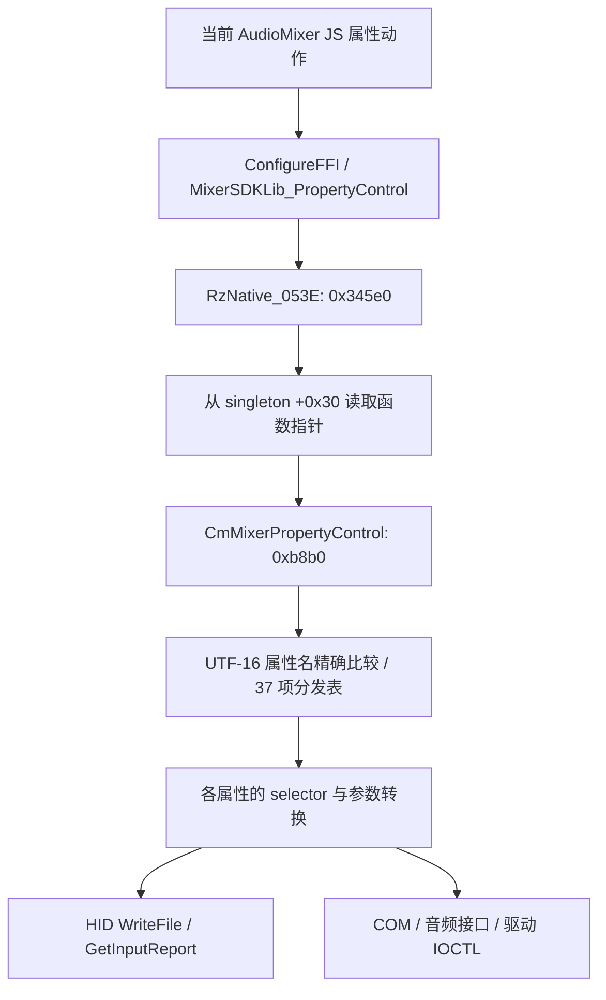

# Audio Mixer 二级 DLL 分发与原始报文

本次继续恢复产品 **1342 / Razer Audio Mixer** 的 DLL 内部，而非直接把 FFI 声明当成协议。[机器证据](audio-mixer-dll-protocol-current.json) 保存当前 manifest 绑定、原 JS UTF-16 范围、两份 DLL 身份、表指针和重新取得的反汇编正文。所有分析仅静态进行，尚未加载库或查询设备。

| 当前原件 | SHA-256 |
| --- | --- |
| `RzNative_053E_v1.0.16.0.dll` | `d3cf6173a2e8bb7af0a1066da3bd9d6038270884b6fcdc5afdaefd349755da5d` |
| `CmMixerLib_v1.0.1.0.dll` | `af10595e3ce6cf9b394488e1929fc6e3d54a887c6be62b66260d7ee507c9e8f2` |

两者由当前产品 1342 manifest 登记；parent 包装层、child 原始 API 和实际运行的加载资源分别记录，不凭名称合并。JS 原件为 `.ref/middleware/1342/AudioMixer.cde922aae2f0fea23404.js`，对应 hash 和 139 条原文范围在机器证据中。

## 外层调用到内部函数



parent 在 RVA `0x336ca` 引用 ASCII `CmMixerPropertyControl`（字符串 RVA `0x25a500`），`0x336d4` 经导入槽 `0x1fe898` 调用 `GetProcAddress`，`0x336da` 把结果存入对象 `+0x30`。对象来自全局 `0x2a6378`。其属性控制入口在 `0x3480a` 从同槽取到 `r10`，`0x3481b` 执行 `call r10`。这是实际的二进制指针存取依据；没有宣称真实运行时装载路径、成功初始化或回调全部闭合。

child 从 RVA `0x134b0` 取 UTF-16 名称表，逐项精确比较，索引上限 `0x25 = 37`；匹配后在 `0xb95d` 按同一索引调用 RVA `0x13380` 的函数指针表。未知属性返回 `-1`。所有 37 项名称、目标 RVA、原表槽、内部潜在调用和 immediate 候选均保存在 JSON 的 `properties`；immediate 候选不能直接当成该属性的线上命令。

## 已恢复的报文 helper

以下是 child 的局部机器码事实，仍需逐属性确认调用参数，不能作为整台设备的通用格式。

| helper RVA | 请求/返回 | 字节布局 |
| --- | --- | --- |
| `0xc170` | WriteFile 请求 report `0x04`；HidD_GetInputReport 读取 `0x12` | 请求 `[1..4]` 为命令的大端 uint32；响应 `[1..4]` 解为小端 uint32 |
| `0xc2f0` | WriteFile 请求 report `0x04`；读取 `0x02` | 请求命令仍为大端 uint32；响应 `[1..2]` 解为小端 uint16 |
| `0xc460` | WriteFile 请求 report `0x13` | `[1..4]` 命令大端；`[5..8]` 参数大端 uint32；Rust `MixerSession::write` 已按实际 descriptor 发送并要求回读确认 |
| `0xc580` | WriteFile 请求 report `0x03` | `[1..4]` 命令大端；`[5..6]` 参数大端 uint16；Rust 已接通硬件端点音量/静音分支 |

查询 helper 将缓冲区清零，候选请求长度 `0x42 = 66`，发送长度受对象内 OutputReportByteLength 限制。发送使用 WriteFile 和对象内 OVERLAPPED；等待事件 100ms，随后复位事件；等待不返回 0 则进入取消/失败路径。成功分支 Sleep 4ms 后调用 HidD_GetInputReport，读取长度来自已存储 InputReportByteLength。没有把这些字段当固定设备描述符，也没有新增兼容性猜测。

查询的输出报告是“发送读请求”，与修改设备设置是不同操作。不能因为 transport 调用了 WriteFile，就误判为配置写回；也不能把全部 WriteFile 路径都列为只读。

## 已追到具体命令的 DSP 固件查询

`RazerT2GetDSPFWVersion` 位于 RVA `0xc680`：先检查全局 HID 对象；如果调用方请求写入，则拒绝；读分支在 `0xc6bb` 将 `0x5ffc001c` 放入 EDX，调用 `0xc170`。

请求前缀是 `04 5f fc 00 1c`，后续缓冲按该 helper 初始化；回复经 `0x12` report 解出 uint32，再交给外层字符串格式化。具体版本分量含义仍未证明，不能自行拆成主版本/次版本。

| 分支 | 属性返回 |
| --- | ---: |
| HID 对象未初始化 | `2` |
| write 标志为真 | `-1` |
| 原始查询失败 | `0x10004 = 65540` |
| 格式化完成 | `0` |

以上均是机器码返回路径，并非实机结果。[控制项证据](audio-mixer-controls-current-evidence.json) 对 37 项属性做整段反汇编和指令门控，生成 [运行配方](../../assets/data/audio-mixer-protocol.json)。Rust [audio_mixer.rs](../../crates/razer-device/src/audio_mixer.rs) 已实现 47 个展开控制项：26 个 DSP/寄存器控制（包括固件只读查询和麦克风监听）、15 个硬件端点 Volume/Mute/Peak 控制、6 条硬件混音路由。它们来自 30 个不同的原分发表属性，不能写成 47 个独立原 DLL 函数。另提供 3 个麦克风监听常量及 5 组端点范围元数据，均标记为源常量，不冒充设备观察。

这些控制项接通独立 agent/IPC 的 `HidNodeMixerRead`/`HidNodeMixerWrite`；字段类型、范围、EQ 频段、声道、描述符、身份及回读确认均在 Rust 中检查。另已接通驱动矩阵及原 0..8 流重置请求。1342 页面的 Noise Gate、Compressor、Vocal Fading、Key Shifter 和 Mic EQ 正在通过当前实际 caller 接入该链，模式与级联提交见 [页面专项](audio-mixer-page-bindings-current.md)。虚拟音频 mixer reducers 不对应这些 HID 端点，仍缺单独实现；本地保存也不能记作设备持久化。6 个原属性仍缺 COM 分支；整个 DLL 完成数仍为 0，初始化、回调、完整页面消费和运行验收不能以配方覆盖替代。

麦克风监听寄存器使用原码 `RazerT2MicMonitorVolumeControl`：查询 `0x5ffc002c`，字段为返回 uint32 的 `0x7f0000`、右移 16 位，负值以绝对值写回，范围由原常量证明为 `-45..=0`、步长 `1`。该读写已进入 Rust DSP session 和 IPC 写回链，仍需页面实际消费者接通。

## 硬件端点、声道与副作用

原 `Volume/Mute/Peak` 先按 jack/flow 选择分支；其他组合进入 COM。已实现的硬件分支如下，不能用于虚拟音频端点。

| 端点 / jack,flow | 音量寄存器 / 宽度 | 静音寄存器 | 峰值寄存器 | 原范围 / 步长 |
| --- | --- | --- | --- | --- |
| Headphones / 1000,0 | `0x1800c028` / 16 | `0x1800c006` | `0x5ffc0054` | -62.25..0 / 0.75 |
| LineOut / 1001,0 | `0x1800c02c` / 16 | `0x1800c002` | `0x5ffc0058` | -65.625..0 / 0.375 |
| Microphone / 2,1 | `0x1800c010` / 16 | `0x1800c094` | `0x5ffc005c` | -12..39.75 / 0.75 |
| LineIn / 3,1 | `0x1800c00e` / 16 | `0x1800c09a` | `0x5ffc0060` | -12..0 / 0.75 |
| Console / 4,1 | `0x5ffc002c` / 32 | `0x5ffc002c` | `0x5ffc0064` | -45..0 / 1 |

音量接受原 channel=-1/0/1，Rust 用 `both/channel0/channel1`，未给未知声道补造左/右名称。Console 的 channel0 为低字节、channel1 为高字节；其他四个端点相反。Both 读取两个原始字节中的较大值，再转换音量；Console 为负值，不能先取两个解码值中的较大者。Headphones 的解码上限为 0。

Mic/LineIn/LineOut 的 Both 写入替换整个 uint16，单声道替换选中字节并保留另一字节；这会按原码清除对应字节的旧静音位。Headphones 每次写入先保留 `0x8080`，Console 保留 `0xffff8080`，单声道也会清除另一个声道的音量位。原 `0xb5f0` helper、连续指令和声道顺序已门控；不能改成统一的“只改音量、保留所有其他位”。

静音写入两个声道，读分支观察 bit15；Headphones 极性反转。峰值返回两个 uint16/32768 的采样，随后向同一寄存器写 0 清除峰值，因此不是无副作用读取。Rust 清零失败返回错误；原码忽略该清零返回，这是明确的实现差异。

## 混音矩阵与 ResetStream 驱动

`RazerT2MixerSettingControl` 的输入 0/4/5、输出 0/2 走 `0x5ffc0010` HID：Microphone→Headphones/LineOut 用 bit2/7，Console 用 bit4/9，LineIn 用 bit3/8。6 条读取和写入已实现。当前 middleware 的 `97829/E2` 明确把 input/output 编成两个小端 int32，参数布局不依据猜测。

其他分支枚举驱动接口 GUID `c129656a-b1ab-4adf-88de-8d2993eb1232`。读 IOCTL=`0x1d6144`，返回 112 字节、28 个小端 float32；写 IOCTL=`0x1da148`，先读完整矩阵、替换选中浮点值、再写全部 112 字节。两张跳转表已从 PE 原字节解码：input 偏移 `[4,1,2,0,6,5,3]`，output 基址 `[0,21,7,14]`；已走 HID 的六组合不能绕过门控改走驱动。getter 仅在选中值精确等于 1.0 时为真，NaN 也为假。静态生成器核对全部 7×4 组合，得到 6 条 HID、22 条驱动路由；驱动写入保留其余 108 字节，包括其他浮点值的 NaN 位模式。

共享 Rust 矩阵编解码和 [Windows 适配](../../crates/razer-service/src/runtime/windows/mixer_driver.rs) 已连接 `HidNodeMixerRouteRead`/`HidNodeMixerRouteWrite`。矩阵按原 `CreateFileW` 参数独占同步打开，attributes=0。适配要求当前 HID 路径、实例、ContainerId 及同容器唯一驱动接口，操作前后重新观察；没有加载厂商 DLL。原件会遍历同类全部接口，Rust 限定选中设备，这是明确的身份策略差异；实际驱动接口是否与 HID 共享 ContainerId 未运行验证，缺失或歧义会报错。Rust 还校验实际返回 112 字节，并在写后回读目标布尔值；这两项是额外确认策略。页面消费尚缺。

`RazerT2ResetStream` 只接受 write，使用同一驱动 GUID、IOCTL `0x222440`，输入为 4 字节 stream index，输出 4 字节缓冲的语义仍未知。原 JS `restartAudioDriver` 依次提交 0..8；不是任意流索引接口。原打开/接口失败 `0x10001`，IOCTL 失败 `0x10003`。Rust `HidNodeMixerRestartStreams` 已执行同一有序序列，每次按原 attributes=0x80 打开/释放驱动句柄，并跨序列保留身份锁。失败返回已完成的索引，不伪造音频恢复状态；成功只确认 IOCTL 完成，不解释原件忽略的输出缓冲。页面消费者和运行验收仍缺，其他平台明确不支持该 Windows 驱动能力。

## COM 与 HID 生命周期

PE GUID 原字节和 `0x4e94..0x4eed` 激活段证明 `MMDeviceEnumerator`、`IMMDeviceEnumerator`、`IAudioEndpointVolume`、`IAudioMeterInformation`。Volume 分支使用虚表 `+0x30/+0x40` 的 master dB 设置/查询及 `+0x50/+0x60` 的声道 dB 设置/查询；Mute 使用 `+0x70/+0x78`。真实端点列表、ID/jack/flow 匹配、回调、引用计数和 OS 适配仍须闭合，不能以 HID 硬件端点代替。

child `CmMixerOpenHID` 会释放旧对象，再构造并枚举 HID；选择函数按系统顺序取首个 VID/PID 匹配，未发现 interface/usage 门控。Rust 保留明确选择且重新观察的 collection 路径及跨进程锁，并核对操作所需 Report ID，不复制原首匹配策略。原 helper 使用 collection 最大 Input/OutputReportByteLength；Rust 按实际 descriptor 取得最大长度，接收实际 ID 长度或该最大长度，超出 66 字节原缓冲边界则拒绝。读取不同宽度不会要求无关 Report 存在。

原关闭函数取消 IO、Sleep 500ms 并关闭对象句柄/事件；Rust 使用 hidapi RAII。原 WriteFile 的 100ms overlapped 等待与 hidapi 写入的阻塞/超时行为未等价。Rust 的 20 秒会话预算只能检查调用之间，不能中断阻塞中的 OS 调用；父进程 IPC 超时另外处理，不冒充原 helper 的超时。

## 不能省略的差异

当前 JS 中存在 `RazerT2KeyShifterLevelEnable`，但这份 child 的 37 项分发表中没有这个名称。不能给它补造 table 项，也不能据此宣布整个功能不可用；仍需追其他实现、分支和实际消费者。

DSP mailbox 读取会写 selector 并轮询，不是纯查询。原 formatter 接受第 5 次仍繁忙的结果；Rust 此时返回繁忙错误。写入无设备 ACK，Rust 额外回读并比对按原码量化后的值，量化确认是本项目策略。EQ 的第一个原 uint32 字段物理单位仍未知，未命名为 Hz；固件原 uint32 未猜测版本分量。各 setter 的类型、范围在发送报告前检查。

EQ 原函数 `0xdd30..0xde60` 的 getter 使用 `(raw >> 1) & 0x7ffff`，gain 从 byte(raw >> 14) 按有符号数除 4 并截断；setter 则对 data 使用 `0x7fff` 掩码，gain 使用 `0x3f` 掩码。两个字段在 getter 中重叠，不能假设原始 data 与 gain 无损往返。例如 setter 输入 `data=0x1234,gain=-4` 的 payload 为 `0x003c2469`，getter 返回 `data=0x61234,gain=-4`。Rust 接受原 uint32 data 并保留 setter 的低 15 位掩码，不再错误拒绝来自真实 getter 的高位字段。页面写入遵循当前 JS 的固定频段模板，使用 data 30/60/120/250/500/1000/2000/4000/8000/16000，不能保留 getter 中与 gain 重叠的 data。原 getter 值只作为独立设备观察；麦克风 EQ 完整数组提交先启用，再依次写 0..9，各步按原 codec 回读确认。详见 [页面链](audio-mixer-page-bindings-current.md)。

已执行 `cargo test --locked -p razer-device audio_mixer::tests` 的 11 项纯 Rust/mock 测试，覆盖原 16/32 位报文字节序、collection 最大长度、EQ 重叠与量化、驱动矩阵保留字节和重置顺序、失败回读、峰值清零、mailbox 轮询上限。模拟传输测试不加载原库或访问设备，不是硬件验收。

HID helper 不等价于全部混音、服务或驱动功能。当前 JSON 的 `unsupported_properties`、`partial_properties` 及专项 COM/driver/lifecycle 记录保留未闭合边界。平台共用协议已隔离，Windows COM/驱动不在其他平台伪装成功；目前只有 Windows 静态编译检查，没有设备或三平台运行验收。

```text
python tools/audit-cmmixer-protocol-current.py --check
python tools/audit-cmmixer-controls-current.py --check
```

校验核对原 PE hash、manifest 归属、GetProcAddress 导入槽、37 项 dispatch、原 JS 收据、report 构造和错误分支原文；不会执行 DLL 或设备命令。
