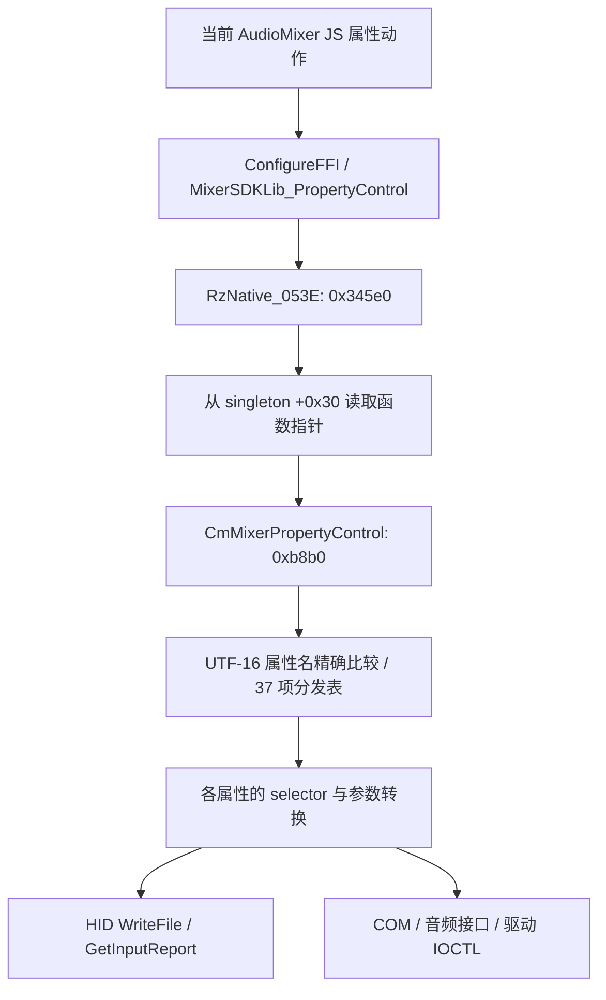

# Audio Mixer 二级 DLL 分发与原始报文

本次继续恢复产品 **1342 / Razer Audio Mixer** 的 DLL 内部，而非直接把 FFI 声明当成协议。[机器证据](audio-mixer-dll-protocol-current.json) 保存当前 manifest 绑定、原 JS UTF-16 范围、两份 DLL 身份、表指针和重新取得的反汇编正文。所有分析仅静态进行，尚未加载库或查询设备。

| 当前原件 | SHA-256 |
| --- | --- |
| `RzNative_053E_v1.0.16.0.dll` | `d3cf6173a2e8bb7af0a1066da3bd9d6038270884b6fcdc5afdaefd349755da5d` |
| `CmMixerLib_v1.0.1.0.dll` | `af10595e3ce6cf9b394488e1929fc6e3d54a887c6be62b66260d7ee507c9e8f2` |

两者由当前产品 1342 manifest 登记；parent 包装层、child 原始 API 和实际运行的加载资源分别记录，不凭名称合并。JS 原件为 `.ref/middleware/1342/AudioMixer.cde922aae2f0fea23404.js`，对应 hash 和 139 条原文范围在机器证据中。

## 外层调用到内部函数



parent 在 RVA `0x336ca` 引用 ASCII `CmMixerPropertyControl`（字符串 RVA `0x25a500`），`0x336d4` 经导入槽 `0x1fe898` 调用 `GetProcAddress`，`0x336da` 把结果存入对象 `+0x30`。对象来自全局 `0x2a6378`。其属性控制入口在 `0x3480a` 从同槽取到 `r10`，`0x3481b` 执行 `call r10`。这是实际的二进制指针存取依据；没有宣称真实运行时装载路径、成功初始化或回调全部闭合。

child 从 RVA `0x134b0` 取 UTF-16 名称表，逐项精确比较，索引上限 `0x25 = 37`；匹配后在 `0xb95d` 按同一索引调用 RVA `0x13380` 的函数指针表。未知属性返回 `-1`。所有 37 项名称、目标 RVA、原表槽、内部潜在调用和 immediate 候选均保存在 JSON 的 `properties`；immediate 候选不能直接当成该属性的线上命令。

## 已恢复的报文 helper

以下是 child 的局部机器码事实，仍需逐属性确认调用参数，不能作为整台设备的通用格式。

| helper RVA | 请求/返回 | 字节布局 |
| --- | --- | --- |
| `0xc170` | WriteFile 请求 report `0x04`；HidD_GetInputReport 读取 `0x12` | 请求 `[1..4]` 为命令的大端 uint32；响应 `[1..4]` 解为小端 uint32 |
| `0xc2f0` | WriteFile 请求 report `0x04`；读取 `0x02` | 请求命令仍为大端 uint32；响应 `[1..2]` 解为小端 uint16 |
| `0xc460` | WriteFile 请求 report `0x13` | `[1..4]` 命令大端；`[5..8]` 参数大端 uint32；写回后置 |
| `0xc580` | WriteFile 请求 report `0x03` | `[1..4]` 命令大端；`[5..6]` 参数大端 uint16；写回后置 |

查询 helper 将缓冲区清零，候选请求长度 `0x42 = 66`，发送长度受对象内 OutputReportByteLength 限制。发送使用 WriteFile 和对象内 OVERLAPPED；等待事件 100ms，随后复位事件；等待不返回 0 则进入取消/失败路径。成功分支 Sleep 4ms 后调用 HidD_GetInputReport，读取长度来自已存储 InputReportByteLength。没有把这些字段当固定设备描述符，也没有新增兼容性猜测。

查询的输出报告是“发送读请求”，与修改设备设置是不同操作。不能因为 transport 调用了 WriteFile，就误判为配置写回；也不能把全部 WriteFile 路径都列为只读。

## 已追到具体命令的 DSP 固件查询

`RazerT2GetDSPFWVersion` 位于 RVA `0xc680`：先检查全局 HID 对象；如果调用方请求写入，则拒绝；读分支在 `0xc6bb` 将 `0x5ffc001c` 放入 EDX，调用 `0xc170`。

请求前缀是 `04 5f fc 00 1c`，后续缓冲按该 helper 初始化；回复经 `0x12` report 解出 uint32，再交给外层字符串格式化。具体版本分量含义仍未证明，不能自行拆成主版本/次版本。

| 分支 | 属性返回 |
| --- | ---: |
| HID 对象未初始化 | `2` |
| write 标志为真 | `-1` |
| 原始查询失败 | `0x10004 = 65540` |
| 格式化完成 | `0` |

以上均是机器码返回路径，并非实机结果。其他 36 个属性继续保留为参数/分支部分恢复，尚未建立全功能等价的 Rust backend。

## 不能省略的差异

当前 JS 中存在 `RazerT2KeyShifterLevelEnable`，但这份 child 的 37 项分发表中没有这个名称。不能给它补造 table 项，也不能据此宣布整个功能不可用；仍需追其他实现、分支和实际消费者。

Volume/Peak 等属性还可经过 COM 音频接口，`RazerT2ResetStream` 有独立 DeviceIoControl 路径。HID helper 不等价于全部混音、服务或驱动功能。来源只证明当前资源绑定与静态指针链，不把共享 JS 内容和默认状态当作产品运行证据。

```text
python tools/audit-cmmixer-protocol-current.py --check
```

校验核对原 PE hash、manifest 归属、GetProcAddress 导入槽、37 项 dispatch、原 JS 收据、report 构造和错误分支原文；不会执行 DLL 或设备命令。
