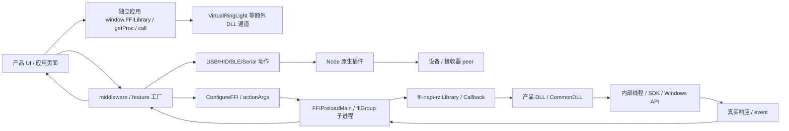

# 当前宿主与 middleware 原生组件、DLL 链路

2026-10-09 重新核查。唯一宿主依据是 `.ref/host-4.0.827/`，产品依据是 `.ref/middleware/<productId>/` 的 HTTP 收据、manifest、AST 与指定 DLL 字节。旧计数、未重新审计的偏移和“全部 PE 导出均未检查”等结论已撤销。逐库、逐产品、逐函数详单见 [完整机器记录](evidence/native-chains-current-evidence.json.zip)。

本次新增 DLL 函数正文逆向。FFI 声明、PE 导出和页面注册不能证明厂商完整 C++ 源码已经恢复；完整恢复整库的数量仍为 0。

**统计与应用资产边界**：middleware 补采已完成；静态扫描当前 middleware 全文件集与 5 个宿主 wrapper，解析 3238 份包含 FFI 声明的 JS，产出 [全量文档清单](evidence/native-library-full-current-inventory.json.zip)。2026-10-10 已去掉生成器仅对文档应用动态归属门禁的区别，并重新生成 Rust 消费的 `assets/data/native-library-inventory.json`；两份 JSON 字节一致，均为 48 库 / 762 静态候选声明 / 3238 来源 / 2332 未归属条目 / 4 签名冲突。旧 963 声明 / 369 来源快照已替换，不能继续使用默认 DLL 名误认实际 init 路径；该清单同步不表示新增函数实现或运行验收。

## 范围与机器记录

| 内容 | 当前文档清单数量 / 实际边界 |
| --- | --- |
| 逻辑库 ID | 48，不等于二进制数 |
| 唯一静态归属候选的 FFI 声明 | 762；另有 4 个签名冲突；3238 份含 FFI 的 JS 静态解析，不能当作运行库实例证明 |
| 产品 manifest DLL | 58 唯一二进制；核对 SHA、大小、架构、导出、导入 |
| 当前 CommonDLL | 4；官方包字节/导出核对 |
| 全产品目录并集 | 596；其中 101 明确声明独立 DLL |
| 未归属条目 | 2332；按签名/原因归并 20 组，包含重复 shared chunk 及 1 条缺 manifest 记录 |
| 正文逆向 | HID.node 7 函数；mapping/simple 新增 8 导出、100 代码范围 |
| 全 ASAR `.node` | 58 个逐文件 hash；PE 核查导出/导入，非 PE 只登记魔数 |

机器记录 `libraries` 包含每个 ABI 声明、源 SHA/UTF-16 区间、调用方法/参数、解码形态、回调/生命周期、会话证据与内部实现状态；`binaries` 包含文件实际身份；`products` 包含全部产品 manifest、DeviceInfo/feature 与库归属；`unresolved_groups` 保留全部未知；`host_chains` 保留宿主/插件 wrapper 的动作与 Callback AST。函数名分类仅导航，不是无副作用证明或调用白名单。

清单归属是可复核的静态声明候选，不是已证明的运行库实例：当前生成器按类内 DLL 字面量汇集声明；新增动态输入门禁只识别 `init*` 中 Identifier 形参直接赋给 `this.dllName`/`this.dllPath` 的形式。逻辑表达式、解构、转交 helper、其他字段或跨类传播尚未穷尽，PE 同名导出也不能消除这些未知。产品归属只来自 manifest；实际使用须继续证明 factory 的具体初始化实参与有效 DLL 路径。

**独立应用的额外通道**：以上 48 库清单扫描当前 middleware 的 ConfigureFFI/ffi-napi-rz 类声明，以及 5 个宿主 wrapper；没有覆盖所有独立应用的其他 FFI 协议。当前 Ring Light/natalie 原件另用 `window.FFILibrary → getProc → call`。原 `init()` 的无参调用可证明该实例选择 `userDataDir + Apps/VirtualRingLight/VirtualRingLight.dll` 回退路径，但本体和其他通道仍须单独核查；不能把 48 库称为全部原生通道已覆盖。页面链、GetCameraList 的编码冲突及返回/成功边界见 [当前 Ring Light 语义](ring-light-ui-current.md) 与 [原件证据](ring-light-current-evidence.json)。

## 原版设备与服务链

当前原代码确实有设备发现：UsbRzDeviceAction 分发 usb.getDevices/hid.getDevices，使用 rz-usb-detect/node-rz-hid；middleware 按 VID/PID/container/interface 选择控制接口。接收器无线 peer 查询与枚举独立；不能把接收器枚举成功当作鼠标参数读取成功。大量鼠标/键盘通过共享 HID 协议类工作，没有同名独立 DLL。

179 → rzDevice25LinkerUma → V2 无线状态 → 接收器接口 → raw peer PID/status → 逻辑产品投影。182 双联鼠标工厂使用 dongle PID/interface，经接收器查询。精确 [能力](receiver-capabilities-current-evidence.json)、[发现](receiver-discovery-current-evidence.json)、[投影](receiver-query-projection-current-evidence.json)、[字段读链](mouse-read-capabilities-current-evidence.json) 单独登记，不能扩称所有鼠标可读。

相机/音频/显示器/Blade/THX/IoT/Hue/系统还有专属 FFI/SDK，同一页面可同时用 HID 与 DLL。确定产品归属必须来自该产品 manifest；shared chunk 里出现库名不能证明该产品会加载它。

## 注册、串行化、生命周期与所有权

这层的完整分支、原文范围及异常语义现单列 [当前宿主FFI契约](host-ffi-current.md) 与 [证据](host-ffi-current-evidence.json)。实际SysUtils还通过注入的legacy ffiMain运行，与renderer Main/Sub实例不同。subprocess-ready只证明消息通道就绪；10秒仅约束动作结果等待，ready等待没有该timer；native异步err及response error可能只日志后resolve，不能把所有异常统一描述成reject。

FFIPreloadMain 按 channel 保存 ffiLibMap/ffiCallbackMap/ffiMutexMap。ConfigureFFI 查文件后 Library(dllPath, apiObj)；已加载 channel 复用并增加 URL。action 索引导出；actionArgs 数组展开，非数组作为单参，缺省才无参。callDLL/callDLLAsync 由 channel mutex 串行化。

结果指针仅在具备 readCString 时复制，finally 用同库 FreeMalloc；缺释放函数只记日志，不能推成正确释放。lighting 返回另用 FreeString。Callback void(string) 在 map 保活，解析 event/events，只转发到存活且 URL 属于库的 webContents。CanUseAnneCallback 的存在不证明全部 callback 线程/ABI。

FFIPreloadMain 的 FreeFFI handler 为空，分支返回 true；不能解释成卸载库或取消回调。较小 ffiMain.js 则删除 Library map，两种当前包内实现必须区分。退出/设备退出/shutdown/suspend 有不同动作表；Terminate 不等于 FreeLibrary。产品成对会话证据在 source_session_chains，空列表仅表示生成器未证明配对。

ffiGroup → ffi_subprocess/index.js → FFIProcess → utilityProcess/MessageChannel → _ffiprocess.js → FFIPreloadSubProcess；UUID taskId、subprocess-ready、10 秒结果等待、独立 ffi-event；异常拒绝 pending 并发布 Razer-FFI-Sub-Process-Crashed。这与 Rust 自己的 service-worker/Job Object 不是同一实现。

底层链 Library → DynamicLibrary → bindings StaticFunctions.dlopen/dlsym → ForeignFunction → CIF → _foreign_function。Library 逐个查导出，空指针抛错，保存 dllObj。Callback 规范类型/CIF，用 native _Callback 建桥；普通路径按 pointer-size 读取 native 参数，Anne 路径直接用 V8 参数；捕获异常，callback Buffer 保留 _cif 防止提前 GC。host callback map 与底层 CIF 保活均需保留。native bridge 内部跨线程调度/ownership 尚未完全恢复。

`_foreign_function` 同步调用为每个参数 ref.alloc、构造 pointer 数组，再 bindings.ffi_call；async 多一个 JS callback，使用 ffi_call_async，并在完成 closure 保留 cif/funcPtr/argsList；返回值按声明类型 deref。`lib/freelibrary.js` 确实提供关闭 dllObj 的方法、非零关闭状态会抛错，成功才把 dllObj 设 null。这证明“存在明确关闭函数”，不能证明上层空 FreeFFI 分支实际使用了它。`lib/bindings.js` 经 node-gyp-build 后调用 initializeBindings(ref.instance)，并非可直接当成普通 C 导出调用的初始化协议。

## 全部库与产品登记

| 功能族 | 已纳入的逻辑库 |
| --- | --- |
| 引擎/灯光/IoT | mapping_engine、simple_service、SysUtilsNative、lighting_driver、IoTNative |
| Blade | BladeNative、blade2Native |
| 系统/超频/主板 | cpuidsdk64、RzAMDOverClock、RzAMDOverClockDLL、RzIntelOverClock、RzIntelOverClockDLL、RzASRock、RzASRockDLL |
| 音频/采集 | audCapNative、CmMixerLib、RzAudioUtil、RzAV、RzNative_0517、RzNative_053E、RzNative_0542、RzNative_0543、RzNative_056a、RzNative_056f、RzNative_058e、RzNative_05a6、RzNative_0D06、RzNative_0D09 |
| 相机 | RzNative_0518、RzNative_0E03、RzNative_0E05、RzNative_0E06、RzNative_0E08、RzNative_GenericCamera |
| 显示器 | ScarlettNative |
| THX/路由 | ThxV3Native、ThxV4Native、ThxVADCarolNative、thxvadvirtualroutenative_1442、thxvadvirtualroutenative_3942、thx_carol_routing_client、razer_clio_x_routing_client、razer_soma_pro_routing_client_1.2.1.59_2 |
| 第三方灯光 | PhilipsHueNative、philipshuev2、NanoleafNative |
| 固件 | RzUMASDKWrapper、Razer_Upgrade_SDK |

每库有全部版本文件名/完整 SHA/产品 ID/安装路径/ABI/调用者/生命周期/回调/内部实现状态。二进制身份按 SHA，不混淆版本别名；未取得本体的库不伪造 hash 或加载成功。

已知声明与 PE 差异：BladeNative_v1.0.10.1 缺 GetBladeBiosAndECVersionInfo/OpenNVControlPanelSetting；GenericCamera_v1.0.35.0 缺 GetShutterLimitControl/SetShutterLimitControl；SysUtilsNative 缺 SimulateMemoryLeak。RzNative_0E08 的 SetBrightness/SetContrast/SetSaturation/GetAutoExposureMetering 有签名冲突，须结合工厂/版本/调用者消歧。

audCapNative、ThxV3Native 的声明表及 PE 本体已取得，但此次复核发现初始化接受外部 DLL 参数，它们的具体实例归属仍需 factory 实参证明；不能继续沿用旧“明确绑定”结论。DLL 正文仍未恢复。mapping/simple 仅选定读链与生命周期完成本次机器码逆向，其余正文未知。101 个 manifest 独立 DLL 产品与其余 495 产品全部在 products；空库列表不等于没有 native 依赖。

20 未归属组保留缺 webpackManifest、动态 DLL 参数/继承/shared chunk 的原始签名/hash/区间/bundle 产品 ID。必须追 factory → 构造器/init 参数 → manifest resource → ConfigureFFI.apiObj，不能按函数名强行归属。

本次发现 THX Carol 类 `initElectron` 先把调用方参数赋给 `this.dllName`，仅无参数时回退到字面量 `ThxV3Native.dll`。同一类有 40 个声明不存在于已核对的任何 ThxV3Native 资源版本导出表；它们虽存在于其他 Carol/virtual-route 库，仍不足以证明实际 factory 传参。文档生成器将所有已识别的同类动态输入作用域保留为 unknown，即使默认库 PE 的导出完全匹配也不例外；总共隔离 875 个作用域，其中该 71 声明 Carol 表有 62 处。候选默认名包括 RzASRock、两代 Hue、IoTNative、ThxV3Native 和 audCapNative。40 个 Carol 声明不再误计入 ThxV3Native；blade2Native 新增的 41 个声明保留为静态候选。这里的 `library_candidates` 不是实际加载结论，也不是调用授权。

这个具体反例的原件为 `.ref/middleware/1306/AudioEffectsTHXCarol.98697d369b62fc7b7117.js`，SHA-256 `a3fc9cfe75e6aeb6e03fdfb404d88997fa7555fa70ee2921c5edbc4365aec1ba`，已记录类 UTF-16 区间 `1000..28152` 与全部签名；其他相同签名作用域仍各自保留源文件/字节收据，不能仅复用该产品的运行结论。

## 动态 DLL 实参的进一步全量追踪

已继续追上述 875 个 caller-DLL 作用域，覆盖 330 个产品环境、28924 份 manifest 声明 JS。新增 [工厂与实参读链](native-factory-current.md)、[计数摘要](native-factory-current-summary.json) 和 [逐作用域压缩证据](native-factory-current-evidence.json.gz)，不再只停在类内回退字面量。相关 2631 个模块上下文解析失败 0；所有 init 正文、导出、真实构造器、调用参数和 unresolved 原因都保留源 hash/range。

329 个作用域追回直接实例/实参链：154 IoT 的 `new → 字段 → init(path)`，175 capture 的 `new → 立即调用函数参数 → initialize(path)`；它们的资源选择器及 `installedResources` getter/常量键均逐份解析。545 个作用域追回带条件链：154 ASRock 的计算 factory/异步 return，154 Hue 的嵌套字段赋值，再接通用 hasDll dispatcher；237 THX 的 lazy 或直接 import → 真实 class → new → runtimeData 字段 → 另一模块别名或直接字段 → init 实参。类身份检查和词法遮蔽门禁分别核对，feature 是否激活分支仍未知。通用工厂索引保留产品 3886 单文件 Hue 的 1 个未解 caller；[3886 专项链路](native-3886-legacy-hue-current.md) 已另行追踪该调用方，不把引用候选算作实际初始化。

原版选择的是安装缓存中的 `name/usedBy/filePath`，不是根据同名 PE 导出决定 DLL。IoT 在 selector 无匹配时仍可能进入 init 默认回退；capture 的实际 caller 在返回路径为空时跳过 initialize。THX 按 `thxv3` 或产品 ID 筛选 THXNativeDLL/RzNative 资源，失败、顺序和子进程状态均影响链路。完整条件见专项文档。静态调用链仍不证明共享 manager 被页面激活、实际缓存记录或运行库身份；因此没有修改 762 候选签名归属或应用资产。

## 包插件与内部正文边界

官方外层 native 条目 29 项。[完整 ASAR 提取](evidence/host-full-asar-current-evidence.json.zip) 后，12 unpacked 插件加 4 CommonDLL 共 16 外层条目有核对字节；其余外层图形库/辅助 EXE 在此只有包清单。全部 58 `.node` 包含跨平台 Sentry stacktrace/usb prebuild，证据 packaged_native_addons 保留身份和 PE；非 PE 只登记魔数。

12 unpacked 插件实际 signed 包字节与 ASAR 声明 size/hash 不同，保留双方值，不截断后伪称相同。来源由官方 internal package SHA 保障。BLE/Serial/FFI/ref/MJPEG/通知已有本体/wrapper，不代表所有内部函数已逆向。

新 [服务函数正文](host-service-machine-code-current.md) 给出 bytes → 导出 RVA → singleton thunk → 构造器证明虚表 → 内部 query/生命周期 → closure → apps/audio/device-mode 线程。HID 七函数另见 [HID](receiver-native-hid-current-evidence.json)。Rust 当前请求/消费者/限制见 [只读接入契约](dll-readonly-inventory.md)。

Audio Mixer 1342 已把 47 个展开的硬件控制项接入 `razer-device`、IPC 和 portable service：26 个 DSP/寄存器控制、15 个音量/静音/峰值端点控制、6 条路由。已逐分支核对声道、位保留、峰值清零、report/caps 长度、身份、写入回读和量化。另已实现 22 条驱动矩阵路由和 ResetStream 0..8 序列的 Windows 适配/IPC；原件广播与 Rust 唯一设备限定存在明确差异，实际目标关联未运行验收。COM 激活/槽位已恢复但端点分支、初始化回调及页面消费者仍缺；整个 DLL 完成数仍为 0。其余 DLL 继续逐项实现，开发没有执行 DLL、应用、厂商 JS、测试或安装器；本地草稿与真实设备响应分别记录。

检查：`node tools/generate-native-library-inventory.cjs --output=docs/re/native-library-full-current-inventory.json --check`；`node tools/audit-native-chains-current.cjs --check`；`node --max-old-space-size=4096 tools/audit-native-factories-current.cjs --check`；`python -X utf8 tools/audit-host-service-code-current.py --check`。最后一项只执行 dumpbin 读取 PE。没有重新生成应用使用的清单或运行其 DLL。
