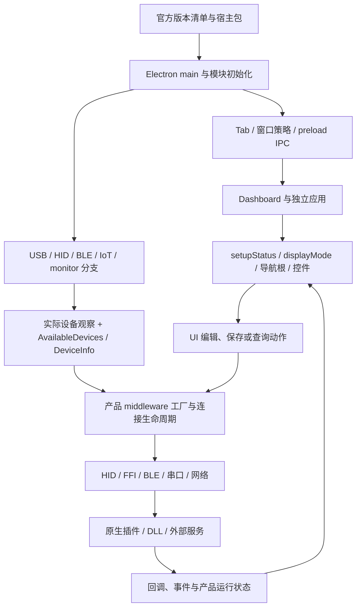

# 当前原代码全量逆向地图

本文是整个原项目的总入口：把宿主、独立应用、产品页面、middleware、原生插件、DLL 与服务分层后再连接起来。用户要求所有实现以原代码为依据；因此“文件取得”“声明解析”“调用链追通”“内部实现恢复”“本项目接入”和“运行验收”分别记录。不能把任一层的清单或成功解析当作全部原代码恢复。

设备直连的下一层证据已进入 [DLL 内部与设备通信逆向](dll-device-communication-current.md)：对全部已取得的 58 产品 DLL、4 CommonDLL 和 19 Windows 原生插件逐文件核对字节、导出和内部指令，保存 57960 个分析图入口。入口与潜在路径不是完整函数语义。产品 1342 的 [二级 DLL 分发与报文](audio-mixer-dll-protocol-current.md) 已追到 37 项属性表、GetProcAddress 指针存取及四个 report helper，其他未知继续保留；[OpenLogi 参考](openlogi-device-communication-review.md) 仅提供架构对照，不作为 Razer 协议依据。

## 来源与证据等级

当前官方宿主来源为静态提取的 **4.0.827**，不是本机仍安装的4.0.821。版本与包链见 [宿主审计](current-host-version-audit.md)。Dashboard 及产品/应用以各自当前 HTTP 与 manifest 收据为依据，见 [Dashboard 来源](20-current-source-version.md)。本轮不重新声称已经核验2026-10-09所有在线端点的实时最新版本。

只读处理 `.ref/host-4.0.827/`、`.ref/applications/`、`.ref/devices/`、`.ref/middleware/`、`.ref/native-libraries/` 及与当前宿主相符的 `.ref/framework/`。不读取或恢复 AGENTS.md 禁用的四个旧目录；不运行 `.ref/tools/` 历史脚本。源码按数据解析，不执行厂商 JS、安装器、应用或 DLL。

| 等级 | 能证明的事实 | 不能据此声称 |
| --- | --- | --- |
| 字节与版本 | URL/包条目、SHA-256、manifest 声明、取得日期、文件存在 | 已理解函数、当前硬件可用 |
| 结构与声明 | AST 节点、导航/组件、IPC 路由、FFI 参数、PE 导出 | 每个条件可达、声明 ABI 已运行验证 |
| 调用与状态 | 原调用者、参数来源、状态门控、返回消费者、生命周期与错误路径 | 闭源 DLL 内部实现全部已恢复 |
| 二进制正文 | 有地址/RVA/字节的反汇编与实际内部跳转/调用 | 编译前原始 C++、变量名、完整类型已找回 |
| 本地实现 | 当前 Rust 消费者、编辑/本地草稿/读取接口 | 设备写回成功或与原 UI 像素一致 |

每条新结论必须有当前源路径和 hash，JS 节点还应给符号、模块与范围；二进制应给具体文件/hash、架构、RVA 和反汇编范围。未知、缺源、动态绑定和签名冲突保留为问题，不能用同名文件或旧产品补齐。

生产JS通常是压缩后的真实发布代码。AST可恢复其模块、表达式和控制结构，但没有原始source map时不能声称恢复编译前TypeScript/JSX文件、原变量名或原注释。原字节保留为事实依据，解释性名称/伪码与原符号分开登记。

## 全量目录的入口

| 层级 | 全量机器记录与可读契约 | 查找方式 |
| --- | --- | --- |
| 所有当前本地源文件 | [字节与 manifest 摘要](full-source-corpus-current-evidence.json)、[完整压缩证据](full-source-corpus-current-evidence.json.gz) | 摘要 `detail` 指向完整JSON；其中 `files[].path/sha256/http`、`manifests[].targets/statuses`、`issues` 与 `absent_bodies` 可逐文件查找 |
| 宿主、窗口、IPC、账户、存储、更新 | [宿主全链](host-architecture-current.md)、[AST 文件/锚点](host-architecture-current-evidence.json) | 模块路径、原方法、输入/输出、生命周期及未追通边界 |
| 宿主通用FFI与SysUtils实际调用层 | [通道/参数/回调/错误/退出](host-ffi-current.md)、[原文证据](host-ffi-current-evidence.json) | 当前Main/Sub、实际legacy注入、ffi-napi-rz依赖；ready与设备状态、FreeFFI与显式卸载分别记录 |
| 完整宿主ASAR和原生addon本体 | [完整提取收据](host-full-asar-current-evidence.json)、[来源与差异](current-host-version-audit.md) | 10,076条目含node_modules；原生unpacked的metadata差异明确保留 |
| middleware缺失脚本补取 | [完整取得状态](middleware-source-acquisition-current.md)、[逐文件结果](middleware-source-acquisition-current.json) | 固定331份webpackManifest、只补原声明文件；每产品URL/hash/错误/断点独立保存 |
| middleware全语法与模块候选 | [语法摘要](middleware-code-current-summary.json)、[完整索引](middleware-code-current-evidence.json.gz) | 28,931声明JS路径、28,304独立内容全部Acorn解析；模块/require/lazy/action均为带源范围的结构候选 |
| 产品身份、导航、根和独立模式 | [产品目录](16-product-catalog.md)、[注册审计](product-registration-audit.md) | PID、edition、原类别、源码 owner、displayMode、导航对象 offset |
| 产品逐页组件、状态及命令候选 | [产品页面链](all-product-page-chains-current.md)、[机器索引](all-product-page-chains-current.json) | 独立页面身份与组件引用；静态调用和未解析分支分开 |
| 产品页面内部控件、子项顺序与动作 | [页面细节](product-ui-details-current.md)、[机器索引](product-ui-details-current.json) | 逐组件 JSX/createElement、动态class/style/props、children/key、父条件、事件及局部声明；代表页另附人工语义，候选不等于运行DOM |
| 全量逐页语义批次 | [逐页批次](product-page-semantic-batches-current.md)、[机器索引](product-page-semantic-batches-current.json) | 331产品/1452页逐页保留根、UI、事件、状态、条件、循环和graph unresolved；所有页面partial，不能把静态候选视为service/DLL闭合 |
| 共享控件交互和调用方 | [控件细节](shared-ui-controls-current.md)、[原文证据](shared-ui-controls-current.json) | slider/number/dropdown/profile/tab/modal/tooltip的实际defaults、键鼠、校验与caller条件；跨产品复用与未审变体分开 |
| 产品样式与资源 | [页面样式链](all-product-layout-chains-current.md) | 挂载class到当前CSS规则/资源；动态class与层叠未知保留 |
| 全页面样式加载、字体和基础元素 | [样式来源](ui-style-sources-current.md)、[原文证据](ui-style-sources-current.json) | 353份HTML的style/link顺序、2110处manifest CSS引用、font-face/根与元素规则/at-rule；预加载、异步声明与最终级联分开 |
| 独立应用 | [应用目录](17-application-catalog.md)、[应用入口链](all-application-chains-current.md)、[机器索引](all-application-chains-current.json) | route → HTML → manifest → webpack 入口；404 不作空应用 |
| 公共与独立应用页面内部细节 | [应用细节](application-ui-details-current.md)、[原文证据](application-ui-details-current.json) | 控件参数/顺序/条件/事件、来源样式及人工分支审读；22 HTML与24端点的未知分别记录 |
| 应用端到端链路 | [端到端说明](application-end-to-end-current.md)、[端到端证据](application-end-to-end-current.json) | 24端点从UI锚点到bridge/IPC、host action、FFI/service/native边界、返回与未闭合错误/清理；全部保持partial |
| 全应用原生与外部进程调用者 | [逐应用语义](application-native-current.md)、[全量原文](application-native-current-evidence.json) | 755 JS中4789显式边界位置、10597源码收据、23人工锚点；THX/Updater/Ring/Studio/Alexa/FW，bundle共享类与实际初始化分开 |
| 独立应用DLL官方资源来源 | [当前调用链与缺口](application-native-current.md)、[2026-10-09元数据证据](application-resource-metadata-current-evidence.json) | 12份官方JSON/XML响应；旧appcast/403与安装资源缓存分开，不据此称已取得最新稳定DLL |
| Virtual Ring Light独立原生/页面链 | [语义解释](ring-light-ui-current.md)、[原文锚点](ring-light-current-evidence.json) | 五种hash页面、控制盘与原生ring、授权、设置、本地存储、FFILibrary声明；仅部分语义恢复 |
| 托盘左右键、完整Widgets与通知分支 | [当前托盘契约](tray-ui-current.md)、[语义原文](tray-semantic-current-evidence.json) | 135条原文、11组语义合同；宿主菜单/点击、实际账户与安装条件、六种widget和storage动作，后端发布者尚未穷尽 |
| 接收器页面深读（源产品241） | [接收器契约](receiver-ui-current.md)、[Pairing原文](receiver-241-semantics-current-evidence.json)、[Lighting/Help原文](receiver-lighting-help-current-evidence.json) | 源样本的readiness、单双绑定/在线/轮询限制、配对状态机/HID；Lighting三卡/八效果及Help两列/复制/固件/确认，实际flags与共享分支分开 |
| DLL、插件、辅助程序及加载链 | [原生件总表](dll-function-inventory.md)、[当前读取契约](dll-readonly-inventory.md) | library → manifest 产品归属 → loader/ABI → callsite/session → 实际 PE 文件 |
| caller传入DLL的实际实例与工厂 | [逐类/参数语义](native-factory-current.md)、[875作用域完整证据](native-factory-current-evidence.json.gz)、[摘要](native-factory-current-summary.json) | 330产品/28924声明JS；329直接实例链、545条件工厂链；3886旧Hue另有独立链已闭合到manager/init/event，运行资源值与feature激活仍分项未知 |
| 3886旧Hue实际调用链 | [3886 Hue契约](native-3886-legacy-hue-current.md)、[原文证据](native-3886-legacy-hue-current-evidence.json) | C6→P2→philipsHueMgr/CX→installedResources精确name+usedBy筛选→path/init→registerHueEvent；hasDll/filePath/DLL身份/返回值仍属运行时未知 |
| 宿主服务 DLL 函数正文 | [读链伪码与解释](host-service-machine-code-current.md)、[机器码证据](host-service-machine-code-current-evidence.json) | 导出RVA → thunk/虚表 → 任务closure →服务线程；实际函数正文覆盖单列 |
| 本项目实现与缺口 | [产品覆盖](native-product-coverage.md)、[缺口](remaining-ui-work.md)、[修复登记](ui-fix-registry.json) | 源链和 Rust 接入分别看；有路由不算 UI 完成 |

详细数量以本轮机器证据为准。596个候选目录 ID、332个 middleware 范围、331个有 UI 的注册产品、363个导航组、1452个导航对象（1419主导航 + 33独立页）、24应用端点不是同一种计数。共享 chunk 的文件存在不能证明该产品会调用其中所有 DLL 或挂载其中所有组件。

本轮完整字节扫描实际核对 **75,408个文件、4,851,226,269字节**（排除旁置HTTP收据和失败响应正文），其中69,641个代码文件、124个native文件；63,518个文件有HTTP收据。684份asset/webpack清单声明的JS/CSS没有本地缺项。仍有189,641个清单目标未取得，主要是媒体/其他资源，不能因此称完整原项目所有素材都已恢复。对应43份旧媒体收据未记录HTTP状态；另1个Dashboard原SVG由单独内容指纹证据离线恢复，保留旧失败HTTP收据，未伪装联网成功。这些边界保留在总清单 `issues`，52个失败或无正文的端点收据保留在 `absent_bodies`。

补取后全部28,931条middleware JS路径的静态语法检查通过，按28,304种SHA独立解析，失败0；路径累计代码1,687,891,178字节。模块/函数计数含共享库与跨产品重复，不用于计算业务逆向完成比例。产品UI解析覆盖与页面树/样式候选另列，不把middleware语法成功计作完整页面实现。

331个产品现全部按同一当前解析器重新读取manifest声明JS并展开1452个导航入口，未解析入口为0，未触及250节点边界，共保留52,461条组件原文和98,727条解引用证据。配对页仍保留实际 `render → renderView → nav.find → name条件 → JSX`，HOME条件保留两个分支；新增CommonJS/webpack导出、真实runtime require/lazy、HTML声明UMD与React Fragment终点，同时检查块/参数遮蔽和同moduleId不同正文。子组件未解析引用共8160条：member5390、export1277、lexical/parameter727、冲突factory766、缺module0。冲突不选first/last补齐；入口覆盖和减少未解不表示页面分支或视觉全部读通。

样式索引现依据重生的组件图包含2022处CSS文件引用、424种独立CSS内容、811,284条页面/规则候选；独立应用索引覆盖24个端点、22个HTML入口、755个已静态解析JS文件与8233个webpack工厂候选。以上是追踪入口和原文证据，本轮全量索引没有据此宣称任何页面已完成逐分支语义审查或视觉一致验收。

本次继续补页面内部细节，并为全部331产品/22应用HTML保留实际样式声明顺序：347处stylesheet link、346个inline style、2110处manifest CSS引用，2064个CSS路径/460种独立内容，4950段font-face与9841段基础元素规则候选。preload没有当作应用样式，manifest顺序没有当作lazy插入顺序。241另逐分支读Lighting与Help，75条原文/14个效果case/25个Help方法/479条CSS上下文；Fire、Spectrum的空参数区，Wave11/12方向，未启用的共享功能与Help宿主链接/版本/复制/重置各自明确。上述新增证据不代表全部页面视觉闭环或Rust已对齐，具体未知继续保留在细节文档中。

全量逐页批次又按每个产品/页面固定了真实根路径、range/hash、UI/event/state/condition/loop候选和graph unresolved：331产品、1452页、413492 UI、82465 event、110024 state、1074164 condition、38314 loop；1452页全部标记partial，854页仍有unresolved，semantic_complete_pages_claimed=0。应用端到端审计另固定24端点、26个UI stage refs、6个host bridge refs及源锚点，逐端点区分host storage、legacy/modern FFI、local service、device observation、service process与infrastructure-only；全部保留partial/unknown，不把bridge存在冒充设备/DLL成功。

完整字节记录采用确定性gzip保存；轻量JSON含解压后大小/hash、各层统计和问题示例。可静态读取而不加载代码：

```python
import gzip, json
from pathlib import Path
index = json.loads(Path("docs/re/full-source-corpus-current-evidence.json").read_text("utf-8"))
corpus = json.loads(gzip.decompress(Path(index["detail"]["path"]).read_bytes()))
# corpus["files"], corpus["manifests"], corpus["issues"]
```

## 从启动到设备页面的原链



这张图表示需逐边核查的层级关系，不能理解为每种产品都经过同一 transport 或同一个 DLL。页面可通过宿主 API 发起全局动作，也可由产品 middleware 调用服务；两种路径的状态归属不同。

设备链从原 `checkAllRzDevice` / `getRazerDevices`、`HD/_checkUSBDetail` 到产品 DeviceInfo 与工厂选择，具体证据见 [身份契约](device-identity-current-contract.md)。原代码存在 USB/HID 发现；DLL 并不是所有设备发现和身份输入的唯一来源。HID.node、USB detection.node、产品 DLL、mapping/simple 服务库也不是同一种 native API。

设备目录字段（名称、类别、别名、edition）是静态元数据；path/container/连接、电量、固件、当前配置等是运行观察。接收器自身的 serial 不能替代无线 peer serial。无观察时不补造 READY、电量、配置或完整空列表。

## 页面、逻辑与样式应怎样逐项读

每个产品保留下面的独立链，不按相同页名套用其他产品：

1. manifest/HTTP → 实际 UI 与 middleware 文件；产品 ID、edition、别名、物理 PID 与逻辑 PID 的关系。
2. webpack 启动与导出 → 产品根；Redux/HOC、setupStatus、displayMode、固件/连接等外层条件。
3. 导航 owner → component/renderComponent → 同文件定义、导入、lazy chunk/module、子组件与弹层。
4. props/state/store → 原值读取与默认值 → 计算/禁用/可见条件 → 事件与命令参数。
5. 挂载 class 与父 containing block → 实际 CSS 规则/媒体查询/层叠 → 字体、图标、图片、布局尺寸、hover/pressed/focus、动画/提示层。
6. Apply/Save/Cancel/删除/重命名 → 本地临时状态或服务/DLL提交 → 回调/错误/取消/卸载与过期返回。

静态 class token 与规则关联只是样式依据索引。动态 class、CSS继承/优先级、组件门户、运行窗口/缩放/DPI与字体栅格不能由规则列表证明。布局和页面功能完成仍按 [UI 完成口径](21-ui-completion-status.md)记录。

主导航 Help、独立 multiDevicePairing、`chromaApp` 根和顶层 Chroma 窗口必须区分。源门控存在意味着控件有运行前提，不能为了本地预览删除门控并冒充设备成功。

## DLL 与服务的逐层拆分

必须依次确认：产品 manifest 归属和原始文件名 → 安装相对路径 → loader 通道和库实例 → apiObj/ConfigureFFI 声明 → 方法与实际参数 → 初始化/订阅/返回解析 → PE 架构/导出/RVA → 函数正文或服务转发。参数来源、callback类型、指针与字符串所有权、超时/线程/释放不能从函数名字猜测。

下面几种原链分别登记：

| 通道 | 原语义 | 审查重点 |
| --- | --- | --- |
| mapping_engine / simple_service / SysUtilsNative | 宿主服务能力 | main 路由、初始化/关闭、callback、外部引擎/进程与返回形状 |
| 产品 ConfigureFFI | 具体 native 库或分发器 | 当前产品的 manifest 实际归属、ABI 冲突、作用域内 caller 与 session |
| HID.node | HID 元数据与 Feature 传输 | node包装与 plain C 导出区别、真实接口/长度/事务/响应、接收器peer检查 |
| USB/BLE/串口插件 | 发现和独立传输 | Node addon 导出不等于可供 Rust 直接调用的 C API；事件与清理归属 |
| lighting / IoT / THX / 相机 / 固件升级 | 各自专用引擎 | 分发编号、数据buffer、句柄、worker/编码/网络/服务、写入权限与完成回调 |
| RzPowerTool / Security / EngineMon 等 EXE | 辅助进程 | spawn 参数、stdio/退出状态、进程生命周期；不能计作 DLL 导出 |

读取操作也可能触发 DllMain、Initialize、订阅和服务会话，不能称“无副作用”。本轮只静态逆向，不加载任何原生件。源码中的 setter/mutation仍整理到链路表，但本项目 DLL 写回后置；UI操作、本地草稿与写回边界见 [读取契约](dll-readonly-inventory.md)。

全量middleware与5个host包装器声明审计覆盖3238个源文件、48种逻辑库、762个唯一静态归属候选签名，另有4项签名冲突及2332个未归属条目/20组。检测到的875个init直接接受caller DLL参数的作用域已隔离为未确认，不能用默认PE同名导出补归属。该检测不穷尽动态表达式与跨类传播；48库也不覆盖所有独立应用的旧FFILibrary路径。Virtual Ring Light已另按实际无参init调用追到fallback、保存getProc编码冲突与返回消费边界。

这875个输入作用域现逐一补了当前init/导出正文，向调用侧追到329条直接实例/参数链（IoT154、audio capture175）及545条条件工厂/存储链（ASRock154、Hue v2 154、THX237）；1个旧单文件Hue实际调用方仍未闭。安装资源getter、installedResources常量键、name/usedBy筛选与userDataDir/Apps/filePath拼接有各自原文。computed factory的真实索引/导出/async return、嵌套字段赋值、跨模块别名和instanceof门控分别保留；构造器存在、条件激活、缓存实际返回和DLL加载成功仍不能混为同一结论。未将新链路强写进原762签名归属或Rust资产。

本轮新追踪 mapping/simple 两库的8个导出与100段机器码。`simpleGetVersionInfo` → apps_service_thread → IO线程、`simpleEnumerateAudioDevices` → audio_service_thread、`getGlobalMode` → device_mode_service_thread，均经过任务与回调，不在导出入口同步返回硬件值。`getGlobalShortcuts` 的任务闭包有 `virtualKey/modifiers/argument` JSON 键证据；模式序列化追出 `hypershift`、`otfs` 仅true时出现、非空 `globalmode` 及记录字段，timeTick从record qword转无符号十进制文本后交JSON插入，原始单位/时钟仍未知。音频最终枚举停在动态audio实例虚表，不把字符串helper当枚举实现。完整序列化、线程退出和其他库正文仍须逐节点恢复，见 [读链文档](host-service-machine-code-current.md) 的RVA表与未知边界。

闭源 DLL 没有随包提供的原始源码时，可恢复的是有证据的汇编/伪码/行为关系，不能保证恢复编译前原文件、名字和完整类型。现有导出、ABI 和包装器覆盖必须与二进制内部实现覆盖单列；未反汇编的库明确标记未恢复正文。

## 状态与持久化不能混合

| 状态域 | 原归属与当前检查入口 | 不能由什么替代 |
| --- | --- | --- |
| 账户/Guest/凭证 | 宿主账户发布、登录通知、renderer用户状态；[宿主全链](host-architecture-current.md)、[托盘状态证据](tray-state-current-evidence.json) | 设备存在、安装目录、本地Guest展示 |
| 安装与模块 | apps、installedModules、下载/安装/服务状态；[模块目录](module-registry-audit.md) | 本地页面能够打开 |
| 物理连接与绑定 | 发现、HID与receiver返回、身份作用域；[设备身份](device-identity-current-contract.md) | 静态产品目录、共享设备名 |
| 设备配置与遥测 | 原query/callback/store消费者；[DLL读取](dll-readonly-inventory.md) | 产品默认配置或本地编辑值 |
| renderer/宿主存储 | localStorage、IndexedDB、memoryStorage、窗口服务或mapping引擎存储，逐具体调用查证 | 全部统一成同一JSON文件 |
| 本项目草稿 | WorkspaceFile与活动profile/device_fields；[工作区](shell-workspace-current.md) | 官方设备/服务保存成功 |

完整链必须同时记录错误、部分成功、取消、隐藏/卸载、身份变化和迟到回调。`[]`、未加载、断开、失败、部分观察是不同状态。

## 继续逆向与维护方式

全量证据先固定文件身份，再追结构与引用，再逐条恢复函数语义/二进制正文，最后据此接入当前项目。暂未追完的组件、动态调用、native入口和服务schema留在各证据的 unresolved/limitations 项中，不删除以制造100%覆盖。

修改现有对应契约和同一机器证据，避免追加日期命名的重复报告。当前Rust行为修复必须额外审查受影响的修复登记，不因文档补齐刷新无关实现指纹。

静态维护入口：

```powershell
python -X utf8 tools/audit-full-source-corpus.py
node tools/audit-host-architecture-current.cjs --check
node tools/audit-host-ffi-current.cjs --check
node tools/audit-application-native-current.cjs --check
node tools/audit-application-resource-metadata-current.cjs --check
node tools/audit-native-chains-current.cjs --check
node --max-old-space-size=4096 tools/audit-native-factories-current.cjs --check
node tools/generate-native-library-inventory.cjs --check --output=docs/re/native-library-full-current-inventory.json
python -X utf8 tools/extract-current-host-asar.py --check
python -X utf8 tools/audit-host-service-code-current.py --check
node tools/audit-all-middleware-code-current.cjs --check
node tools/audit-ring-light-current.cjs --check
node tools/audit-tray-semantic-current.cjs --check
node tools/audit-receiver-241-semantics-current.cjs --check
node tools/audit-receiver-lighting-help-current.cjs --check
node tools/audit-ui-style-sources-current.cjs --check
node tools/audit-shared-ui-controls-current.cjs --check
node tools/audit-application-ui-details-current.cjs --check
node tools/audit-application-end-to-end-current.cjs --check
node tools/summarize-product-page-semantic-batches-current.cjs --check
node tools/validate-full-ui-chains.cjs
python -X utf8 tools/report-full-ui-chains.py --check
```

产品/应用/样式图使用对应提取器的校验模式；具体命令及边界由产品/应用目录登记。`--write`只在核对新证据之后使用，不盲目覆盖冲突。应用、测试、安装器、下载的JavaScript与DLL运行验收仍为 `not_run`。
