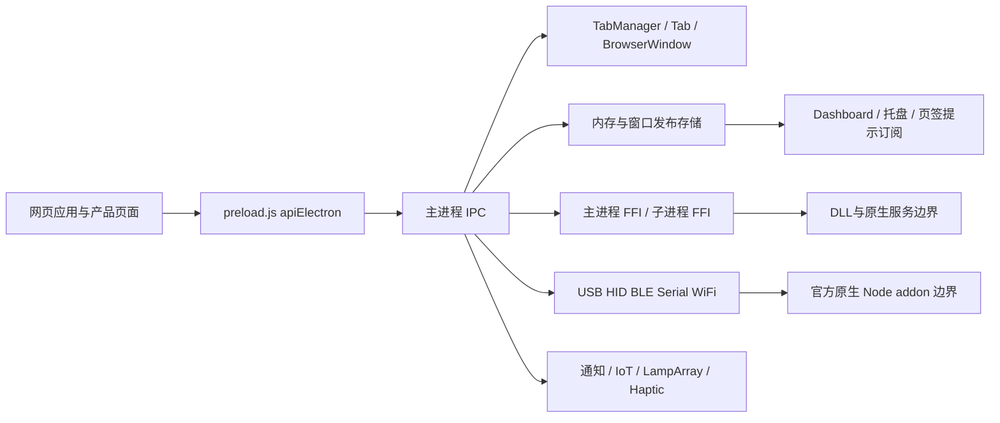

# 当前宿主完整链路地图：Razer App Engine 4.0.827

2026-10-09。本文重新读取当前 `.ref/host-4.0.827/`，梳理宿主入口、窗口、IPC、账户、存储、托盘、更新与退出链；不采用已删除的旧宿主或旧前端。版本取得时间仍是 2026-10-02，不能把本次文档复核日期写成重新查询生产版本的日期。官方包与 ASAR 来源见 [current-host-version-audit.md](current-host-version-audit.md)。

机器证据：[host-architecture-current-evidence.json](host-architecture-current-evidence.json)。维护工具：[audit-host-architecture-current.cjs](../../tools/audit-host-architecture-current.cjs)。生成使用 `node tools/audit-host-architecture-current.cjs`，只读复核使用 `node tools/audit-host-architecture-current.cjs --check`。工具只调用 Acorn 解析文件；不 `require`、导入或执行参考宿主代码。

## 1. 覆盖口径与证据定位

当前宿主 `electron/` 共 **112 个 JS/CJS 文件**。其中 6 个是明确的第三方浏览器库或编辑器：JSZip、React、React DOM、React Redux、Vue、JSONEditor。本次宿主链路索引覆盖其余 **106 个文件、983,610 字节、3,052 个函数 AST 节点、398 条字面量 require 导入和 18 个 IPC handle 定义**。排除文件也记录路径、大小和 SHA-256。

证据中 `files` 为每个第一方文件保存原始字节 SHA-256、导入、可命名函数/方法范围、CommonJS 导出、静态字面量事件监听、IPC handler 及 switch action 分组；`anchors` 保存关键原函数全文和范围。相对字面量 require 另外解析当前目标文件，当前没有未提取的相对目标；非字面量 require 与动态 import 独立记录为 `dynamicImports`，不能因导入清单缺少常量名而忽略子进程代码。`start/end` 是 Acorn 的 JavaScript 字符串偏移（UTF-16 code units，前闭后开），**不是文件字节偏移，也不是源图还原的行号**。

这实现了所有现存第一方宿主 JS 的静态索引，下面对关键跨文件链做了语义阅读。它**不等于已经逐个解释 3,052 个函数的所有分支**，也不等于已经恢复 `.node`、DLL、EXE 的 C/C++ 原始源码。目录外的 node_modules 内部、服务进程内部、远程接口实现和原生二进制内部仍有边界，详见第 11 节。

完整包来源另由 [ASAR全量提取收据](host-full-asar-current-evidence.json) 覆盖10,076个条目，包含此前未提取的node_modules与12个unpacked原生插件本体。它与本节106个第一方JS的语义索引是不同分母：依赖文件如今已取得，依赖每个函数的逻辑仍没有全部审阅。signed native条目与ASAR元数据hash/size的差异保留在收据及 [版本审计](current-host-version-audit.md)，不宣称二者匹配。

## 2. 分层与状态归属

| 层 | 当前原文件/符号 | 持有的真实状态或责任 |
| --- | --- | --- |
| 入口与编排 | `package.json:main` → `electron/main.js` | 应用单实例、环境、共用原生服务初始化、应用启动集合、托盘、退出协调 |
| 主进程共享对象 | `lib/globalNodeVar.js:globalNodeVar` | `winMap`、`appEvent/events`、三类存储、FFI 实例、`appLaunchedList`、语言、不可退出名单、机器标识、`isQuit` |
| Renderer 桥 | `preload.js:apiElectron` | 将网页调用转换成 IPC；提供事件订阅与取消句柄；不自行完成设备状态读取 |
| 宿主窗口/页签 | `components/Tab/{common,TabManager,Tab,TabStore,TabUI}.js` | 原生宿主窗口、产品 WebContentsView、DOM 页签、活动页签、隐藏/休眠/恢复 |
| 实际设备能力 | `UsbRzDeviceAction.js`、`modules/*` 与 FFI wrapper | 传输句柄、原生请求、回调；产品参数与产品功能表在应用侧，不能仅从宿主入口判断支持 |
| 网页身份 | 网页账户逻辑 + `preload.js` BroadcastChannel | `currentUserId/currentGuestUserId`；经 IPC 通知主进程登录态，不是 `winMap` 或 USB 设备属性 |
| 登录事件桥 | `main.js:Gn`、`lib/identityPipe.js` | feature flag 门控后向命名管道发送事件；管道接收进程内部不在本包 JS 中 |

`globalNodeVar` 原初值 `appLaunchedList=[]`、`lang="en"`、`machineId=null`、`isQuit=false`。这些默认值不能替换为“已读到用户/设备/服务”。

## 3. 启动、应用与模块

### 3.1 进程启动顺序

1. `package.json` 声明 `main="electron/main.js"`，版本 `4.0.827`；`engineVersion.js` 同版本。
2. `main.js` 加载当前 constants、日志、参数解析、应用 host 解析。缺省 host 是 `https://apps.razer.com`。`getAppHost.js` 先解析 hostname：`localhost` 可保留 HTTP；`.razer.com` 使用 HTTPS；不符合的参数回落缺省 host。
3. 确定 User Data 目录，设置 Electron `userData` 到其 `Default` 子目录；初始化 `MemoryStorage`、`WindowStorage`、`KeyStorage`。创建共享 `DLLRegistry`、主进程 preload FFI、子进程 FFI、mapping/simple/sysutil/lighting wrapper；**创建 wrapper 与加载 DLL 是不同阶段**。
4. 申请 Electron 单实例锁。无锁者退出；持锁者处理 `second-instance`。默认暗色主题；根据 buildSettings 与命令行配置调试、日志、代理、升级/重启状态。
5. `app.whenReady().then(async()=>...)` 中加载通知 key、endpoint 请求头、可选 memory telemetry/extension；检查 AIO 更新有效期与 service-worker 请求策略；安装屏幕处理，调用 `UsbRzDeviceAction.initUSB()` 和 BLE endpoint 监控。
6. 选择 `CommonDLL` 路径。Windows 打包版来自 `Program Files/Razer/RazerAppEngine/app-4.0.827/CommonDLL`；开发版来自 `electron/../CommonDLL`。正常分支只在文件存在时初始化 `SysUtilsNative.dll`、`mapping_engine.dll`、`simple_service.dll`，缺文件写警告。调试 CommonDLL 分支另外复制/使用 User Data `Apps/Common`。
7. 创建退出 event、做 Windows device security 检查；按参数做 registry 迁移/升级收尾；`launchRazerApps` 或开发 `createDefaultWindow` 启动应用。之后创建原生 Tray、`LeftSystray`、菜单，订阅窗口变化，启动 engine monitor；`whenReady` 失败会记录错误并将启动准备 promise 解析为 false。

证据定位：`anchors.startup-ready` 保存第 5–7 步的当前回调；`files.main.js.imports` 可逐一展开主进程依赖。没有执行这里的任何初始化。

### 3.2 当前宿主顶层应用表

`constants.js:razerAppPathEnum` 定义 URL；`main.js:xn`（日志语义名 `launchRazerApps`）匹配应用。已存在 `winMap` 项时先聚焦；否则解析窗口参数并调用 `common.js:createWindow`。

| appName | 页面路径 | 初始窗口/策略（未计 DPI/后续网页调整） |
| --- | --- | --- |
| `synapse` | `/synapse/dashboard/` | 1280×720，最小 600×500，policy 5，初始 `browser_visible=0` |
| `chroma-app` | `/chroma-app/dashboard/` | 1280×720，最小 600×500，policy 5，初始隐藏 |
| `razer-settings` | `/settings/` | 1280×720，最小 600×500，policy 5，初始显示 |
| `virtual-ring-light` | `/natalie/` | 255×255，policy 6，不可调整，初始隐藏 |
| `streamer-companion-app` | `/alisha/` | 1280×720，最小 600×500，policy 5，初始隐藏 |
| `spatial-audio` | `/sophie/` | 1004×725，policy 5，不可调整，初始隐藏 |
| `cortex` | `/cortex/` | 1024×640，最小同值，policy 6，初始隐藏 |
| `sophie-lite` | `/sophie-lite/` | 604×605，policy 5，不可调整，tab 与 browser 初始隐藏 |

函数还包含 `jstestrzdevice*`、`jstestnatalie`、`jstestgms` 与 `cache` 调试/缓存入口。它们出现在原源码中，不表示当前生产账户一定启用。`autoStart`、`launch-force-hidden` 和成功加载后 `appFocus` 可进一步改变可见状态。菜单中的安装目录集合、`appLaunchedList` 与实际 `winMap` 是三种不同集合。

Synapse 内部模块注册和产品页面由当前应用代码控制，不是上述八个宿主顶层应用的简单附属窗口；模块表见 [module-registry-audit.md](module-registry-audit.md)、产品身份链见 [device-identity-current-contract.md](device-identity-current-contract.md)。

## 4. 窗口、页签、休眠与恢复

### 4.1 打开链路与 policy

当前既有 Tab 发起请求的链是：网页 `window.open(url,name,features)` → `Tab.js:createTab` 的 `setWindowOpenHandler` → 解析 feature → 同名 Tab 先聚焦/拒绝重复 → 同名 `winMap` 先发送 `appFocus`/拒绝重复 → 外部地址交 `shell.openExternal` → policy 分支。

`policy=5/6/7/8` 调用 `common.js:createWindow` 创建 BrowserWindow；其余请求有既有宿主时通过 `sendCreateNewTabAction` 发出 `createNewTab`。policy 3 的 `attachToWindow` 可选择另一既有宿主，仍是加 Tab。

完整 Tab 链：`common.sendCreateNewTabAction` → `tab-message/createNewTab` → `TabUI.createNewTab` 创建 DOM → `apiElectron.doTabAction` → `ipcRenderer.invoke("tabEvent",...)` → `TabManager` 的 `tab-create` → `new Tab(...).init()` → 创建 `WebContentsView`（Electron <30 为 `BrowserView`）并挂在既有 BrowserWindow 上。详细跨模块证据见 [host-window-policy-current-audit.md](host-window-policy-current-audit.md)。

`lib/common.js:convertFeatureToWindowOptions` 将 policy、width/height、最小尺寸、show、frame、transparent、skipTaskbar、resizable、canHibernate 等映射到 Electron 参数。policy 6/8 透明无框；policy 5 使用 hidden titleBarStyle；`gms-proxy/lighting-engine/remote-sync-worker` 或 policy 7 有单独改写。**不能仅凭 windowName 中包含 window 推断独立 OS 窗口。**

### 4.2 页签状态及生命周期

| 状态/操作 | 原来源 | 语义 |
| --- | --- | --- |
| Tab 集合 | `TabStore.tabList` | `frameName/url/featureObj/windowId` 与实际 WebContents；同名 Tab 复用 |
| 活动 Tab | `TabStore.windows` | 按 BrowserWindow id 保存 `tabName/isForceFocus/isTabChangingWhileMinimize` |
| 手动关闭/强制聚焦 | `TabManager` + `TabStore.manualCloseViews/forceFocusingTab` | 请求关闭与直接关闭不同，需走原 action 链 |
| 可休眠 | `TabStore.hibernateViews` 与 `common.BrowserUtil` | 默认 timeout **120,000 ms**；具体 hide/window 路径可传 timeout 0，并非所有路径等 120 秒 |
| 休眠拒绝名单 | `TabStore` 原常量 | `lighting-engine,otfm,background-manager,remote-sync-worker,systray-left,notification-manager,gms-proxy,background-manage`；不应凭名字省略最后一个原项 |
| 用户窗口关闭 | `common.createWindow` 的 `close` + `willClose` | policy 5 且 `willClose=false` 时 hide 并阻止关闭；最终退出需先设 willClose |
| 休眠恢复 | `Tab.createTab` / `BrowserUtil` | 保留 URL、features、身份；恢复实际 WebContents，与只切 DOM 可见性不同 |

`TabUI.js` 负责 DOM 排序、选择、关闭、溢出滚动、快捷键交互；宿主页签外壳主内容起点在 `common.setViewBounds` 为 **42px**，Windows 10 正常非最大化分支带 1px/2px 边界调整。CSS、标题栏资源与产品页面内容仍需各自证据核对。

### 4.3 失败分支

`Tab.js` 非 `-3` 的 `did-fail-load` 进入 `NetworkLostFallback/index.html`，标记 `fallbackMode/failToLoadView`，发送失败页签状态。`-3` 是取消加载路径，直接返回。当前 `common.js` 的 `background-manager` 失败重试为 **1、2、4、8、16、32 秒**，六次耗尽后等待 `networkStatus` 为在线再重启；成功清零；窗口关闭清理 timer/listener。Razer ID 失败有单独 fallback 显示/聚焦分支。不能把这两种失败处理合并成通用“空页面”。

## 5. 所有静态 IPC 入口

以下 17 个 handler 位于 `main.js`，另外 `tabEvent` 位于 `TabManager.js`。每个处理器全文、范围、action switch 分组见证据 `files[].ipcHandlers`。有字面量 `handle` 索引并不代表任意 action 都合法；USB/BLE/串口等 wrapper 另做 actionMap 或 switch。

| Renderer 方法 | IPC channel | 主进程目标 |
| --- | --- | --- |
| `doElectronAction` 与窗口便利方法 | `electronAction` | 主进程窗口/账户/存储/系统工具/退出 action switch |
| `doTabAction` | `tabEvent` | `TabManager` tab-create/change/close/request/tooltip/update/userFocus |
| `doDLLMainAction` | `ffiPreload` | `FFIPreloadMain.callDLL` |
| `doDLLMainActionAsync` | `ffiPreloadAsync` | `FFIPreloadMain.callDLLAsync` |
| `doDLLSubProcessActionAsync` | `ffiSubPreloadAsync` | 子进程 FFI manager `callDLLAsync` |
| `doMappingEngineAction` | `mappingEngineAction` | mapping wrapper `callDLL` |
| `doSimpleServiceAction` | `simpleServiceAction` | simple service wrapper；simpleLaunch exitCode 3010 另记录 driver install |
| `doLightingDriverAction` | `lightingDriver` | lighting wrapper；InitDLL 注册 DLLRegistry |
| `doRzDeviceAction` | `rzDeviceAction` | `UsbRzDeviceAction.handleAction` |
| `doSerialDeviceAction` | `rzSerialDeviceAction` | `serialActionMap`，拒绝不在表的 action |
| `doBleDeviceAction` | `rzBleDeviceAction` | `nobleActionMap`；`ble.send`另拆 wrapper/传输 envelope |
| `doIoTDeviceAction` 的 `wifi.*` | `rzWifiAction` | `wifiActionMap.get(action)(payload)` |
| `doIoTDeviceAction` 的 `IoT.*` | `rzIoTAction` | `IoTNativeAction.handleAction` |
| `doLampArrayDeviceAction` | `rzLampArrayAction` | `LampArrayAction.handleAction` |
| `doNativeNotificationAction` | `nativeNotification` | `nativeNotificationHandler` |
| `doRzWssAction` | `rzWssAction` | `WssAction.handleAction` |
| `doKeyStorageAction` | `keyStorageAction` | `KeyStorage.callFunction` |
| `doHapticWssAction` | `rzHapticWssAction` | `HapticWssAction.handleAction` |

`preload.js` 的 `doDLLAction/doDLLActionAsync` 原实现只打印 **deprecated**，不能拿旧方法名接入并宣称成功。`response(channel,fn)` 包装 `ipcRenderer.on`，返回 removeListener 函数。`pagehide` 清除 tab/async/windowStorage/window-list listeners、关闭 BroadcastChannel，并在 iframe 上通知 `close-iframe`。

`electronAction` 内部包含：窗口位置/尺寸/可见性、窗口列表与聚焦、Tab 手动关闭/强制聚焦、休眠、文件对话框、login/logout、系统原生查询、三种存储、lighting 生命周期、服务管理、feature flag、重启/退出。证据保留每组原 case 与实际执行体；同一连续 case 组共享执行体，不能按单个没有语句的 case 误报“无实现”。

## 6. 账户、Guest 与登录事件

1. 网页在 `electron-broadcast-channel` 发 `loggedIn/loggedOut`。`preload.js` 收到登录时读 `localStorage.currentGuestUserId` 和 `currentUserId`：Guest id 非空且等于当前 user id 才将 `payload=true`；另传 `razer_uuid=currentUserId`。
2. `main.js:electronAction/loggedIn` 首次把局部 `an`（登录态）置 true、`sn`（Guest 标志）设为 payload 并重建右键菜单。`GetMachineId` 经 SysUtils wrapper 异步读取并缓存到 `Bn/globalNodeVar.machineId`，更新 extraInfo/telemetry。
3. `Gn` 检查 `--identity` 强制开关，否则查询 `global.identity` feature 的 `enabled===true`。启用后 `sendUserSessionEvent({event:"login",razer_uuid,machine_id})`。
4. `identityPipe.js` 对 `\\.\pipe\RazerAppEngine-session` 发 JSON：登录为 `{type:"user-session",event,razer_uuid,machine_id}`；退出为 `{type:"user-session",event}`。连接 timeout **3000ms**，缺省 retries 5 表示最多 **6 次**尝试，重试间隔 500ms；失败记录日志，没有伪造成功回复。
5. `loggedOut` 清除主进程登录/Guest 标记，重建菜单，feature 启用时发送 logout。`will-quit` 在已登录时防止第一次立即退出，发送 logout（retries 2）后最终退出。

右键 Log In/Out 先发 `electron-action/logIn|logOut` 给所有活跃 WebContents，再交 `LeftSystray.login/logout`。**主进程的布尔登录标志不包含完整用户头像、名称、credential，也不能替代 systray 网页的 user item。** Guest 是身份链中真实的 Guest id；项目里的本地 Guest 展示不得记为读取官方账户完成。

feature 获取链：`getAppFeature.js` → `${host}/ff/appengine-prod-flags.jws`（可带 endpoint、代理）→ JOSE compactVerify → 缓存 `Apps/Common/featureSettings.jws` → 按 key 返回；请求失败尝试签名验证本地 fallback，两者失败向上抛。原代码还含代理条件下接受 JSON 对象响应的分支；这里只记录原行为，没有运行该分支。已取得 flags 的模块级闭包会复用结果。

## 7. 跨页面存储与设备状态发布

| 存储 | 主进程结构 | get/set/事件语义 | 持久性 |
| --- | --- | --- | --- |
| `MemoryStorage` | `Map<senderURL,Map<key,value>>` | getItem 汇总各 URL 的 truthy 值为 JSON `{value,windowName}` 数组；set 可 override url，含 created/changed/oldValue/srcURL；可 targetUrlArray | 本模块只有内存 Map |
| `WindowStorage` | 同样按 URL 分组 | `connectedDevices` 等跨页面发布；getKeys 跨 URL 去重；set/remove 排除来源 sender 与 remote；按注册/窗口版本规则决定通知 | 本模块只有内存 Map；window clear 是发布状态清理，不是设备配置删除 |
| `KeyStorage` | `Map<key,{value,hasValue,urlEventList}>` | key 全局；订阅 URL 显式登记；set/remove 回 `{result,reason}`；getItem 返回值或 undefined | 本模块只有内存 Map |
| Electron session/localStorage/网页服务 | 不在以上 Map 内 | `TabStore.writeData` 调 `session.flushStorageData`；账户 id 由网页 localStorage 读取 | 另一个持久层，不可混同 |

原 getMemory/WindowStorageItem 仅收集 truthy value，值通常又是 JSON 字符串，因此消费者往往需解析外层数组再解析每个 `.value`。`windowName` 在这两个存储里实际是 **URL 分组键**；设备自身 `UIWindowName` 才是产品页面身份，字段同名不等于同一含义。

页签 tooltip 原链：产品页面发布 `connectedDevices` → `windowStorageEvent` → `preload.js` tooltip 实例 → 根据 `UIWindowName` 匹配设备 → 按 language 读 productName/editionName/name → 根据 activeProfile guid 查 profile → powerStatus 映射电池。产品图片还分 edition/layout/sidepad/wristrest，与托盘 Widgets 用类别 SVG 是不同展示链。

**观察状态与写回必须区分**：存储 setter 是跨页面消息发布，不证明刚写过硬件；本地 profile 草稿也不能作为 `activeProfile` 已由官方服务确认的证据。官方页面/DLL 调用完成后的具体发布时机应沿应用侧调用继续追踪。

## 8. 托盘左右键及应用列表

`main.js` 创建 Electron `Tray`，左键 `LeftSystray` 类处理，右键 `Menu.buildFromTemplate` 与 `Tray.setContextMenu` 处理。

左键：`LeftSystray.init` 创建 `${host}/systray/systrayv2/` 初始 300×200、policy 6、always_on_top、skipTaskbar、无 shadow、不可 resize 的隐藏 BrowserWindow → click 时隐藏状态先 align → **200ms** 后发网页 `electron-action/click` 并 focus → 网页 current systray 根据自己的 user/launcher/widget 状态控制显示与尺寸。double-click 发独立事件并清 click/blur timer；blur **300ms** 后 hide。这里的初始尺寸**不是已登录 Widgets 最终布局尺寸**。

加载失败时 `hasError=true` 并创建 Razer ID 登录窗口；生产 `apps/appsbeta` 用 `https://id.razer.com/`，其余用 staging ID。登录请求在 systray 未成功加载时 `reInit(true)`，成功加载后关已有 Razer ID 窗口并发 logIn。

右键菜单 `main.js:zn`（语义名 `createSystrayMenuRight`）扫描 User Data `Apps` 子目录，对照 `razerAppInfo`，按 language 与 beta icon 生成应用行；然后 settings、login/logout、separator、运行应用退出项和总退出。已运行集合来自 `winMap`，安装集合来自目录；菜单触发最终经 `launchRazerApps/focusWindow/quitApp`。原登录标签条件是 `an&&!sn` 才显示 Log Out，其余显示 Log In，但 click 回调按 `an` 选择 logout/login，不能自行把 Guest 分支简化。

systray 网页尺寸、Widgets 类别/电池/配置、launcher 页脚与版本的更深证据见 [tray-ui-current.md](tray-ui-current.md)、[tray-widgets-current.md](tray-widgets-current.md)。右键 native menu 与左键网页浮层属于两套实现。

## 9. 更新、服务与退出

### 9.1 更新与原生服务

生产 host 的下载清单链见 [current-host-version-audit.md](current-host-version-audit.md)，不在本次重新下载范围内。宿主 JS 中的更新收尾是另一段链：

`--upgrade`/Logs `relaunch.log` → 还原 host/apps → `mainSubFunction.upgradeAppEngineVersion(simpleService,current,previous)` → 检查旧 `app-<previous>` 路径 → 确保 User Data `Apps/Common/RzPowerTool.exe` → `simpleLaunchUserAppProcess` 带 `--update-razerappengine-version-reg <current> --delete-old-razerappengine app-<previous>`。这里只读取原逻辑，没有复制、执行或删除原安装目录。

`relaunchWithLauncher` 写 `Logs/relaunch.log` 的 `{apps,host}`，有顶层 `RazerAppEngine.exe` 时指定 execPath 重启，否则 Electron 默认 relaunch，然后走退出链。`exit-app-relaunch.log`、`uninstall-relaunch.log` 是另外的重启恢复参数，不能全部当作配置存档。

`serviceFunction.js:{getServiceStatus,startService,stopService}` 通过版本目录 `CommonDLL/RzPowerTool.exe` 与 simple service wrapper 的 launch 调用执行 `--get-service-status/--start-service/--stop-service`。**函数名不是 DLL 导出名的充分证据**：这一层实际是 native service 启动工具 EXE。EXE 不存在时返回 undefined 并日志告警。

### 9.2 退出的完整协调

`main.js:Dn`（`quitApp`）先检查 `cannotExitAppNameList/cannotExitAppEngine`。退出被拒向页面发 `exitAppRejected`；全退出连续拒绝计数到阈值后可强制继续，forceQuick 另绕过检查。单应用退出删除启动集合和对应休眠记录；总退出设置 isQuit 并清启动集合。保存启动集合文件，广播 `exitApp`（含 appName/runningApps），等待 **200ms**，发内部 `exit-app`。

不再需要 Synapse/Chroma 时，lighting engine 最多等待 **10×200ms**；正常退出看 `lightingEngineExitCompleted`，系统 shutdown 看 `lightingEngineCanShutdown`。停止 WssAction 后按 simpleQuit/剩余应用决定关闭目标或全部窗口。

关闭兜底链包含 10 秒再次关闭窗口、再 5 秒 `quitAppFinal`、再 5 秒 `app.exit`。`window-all-closed` 也进入最终退出。

最终 `Mn`（`quitAppFinal`）顺序：标记 isQuit、解绑 winMapChanged/取消菜单 250ms 防抖 timer → 子进程 `APIToCallWhenExit` → 主进程 `callApiWhenExitDevice/callApiWhenShutdown/callApiWhenExit` → SetExitEvent → SysUtils Terminate（3秒 timeout）→ USB stop/BLE endpoint stop → mappingEngineShutdown（3秒）→ simpleServiceShutdown（3秒）→ 保存日志 → app.quit → tray.destroy。`before-quit` 另停止 memory telemetry 和 Haptic；`will-quit` 负责账户 logout。这些 lifecycle 原生调用不能在只读开发核实时执行。

## 10. 所有第一方宿主文件所属链

机器证据已经逐文件索引，下面按目录定位功能族；不是把未阅读的原生实现自动标成完成。

| 功能族 | 文件位置 | 与主链关系 |
| --- | --- | --- |
| 入口、常量、工具 | 根 `main/mainSubFunction/constants/buildConstants*/engineVersion/arrayHelper/dirHelper/devtools/errorMsgConst/RzWindowVersion` | 入口、环境、版本与窗口版本协议 |
| 窗口/外壳 | `components/Tab/*`、`components/Titlebar/titlebar.js`、`resources/images/titlebar-imgs.js` | 原生宿主、DOM Tab/标题栏/托盘左键 |
| 调试状态页面 | `components/DebugWindow/components/*`、`utils/html.js` | 读取/操作 WindowService/MemoryStorage/WindowStorage 调试 UI；生产是否显示受 build flag/参数约束 |
| 网络、参数、身份、功能门控 | `lib/getAppHost/parseApplicationHostToken/parseCmdParams/getAppFeature/getIdentityFeature/identityPipe/getMemoryTelemetryFeature/getSentryConfig/request/useProxy/withExtension/aio` | host/token 解析、代理、请求、JWS flags、named pipe |
| 日志/环境/兼容 | `lib/common/useLogger/useLoggerInjector/extraInfo/exeCompatibility/openDevTool/filterDriverInstallTracker/globalNodeVar/RzMutx` | 日志、OS/执行工具、窗口规则、兼容检测、互斥 |
| 托盘资源缓存 | `lib/systrayIconCache/createDebouncedSystrayRebuild` | 原生 icon 缓存与菜单变更防抖 |
| 存储/迁移 | `keyStorage.js`、`modules/{memory_storage,window_storage}`、`migrateProductionData.js` | 内存发布与独立迁移代码；持久写是否成功仍依执行结果 |
| 通用 DLL 路由 | `modules/dll_registry`、`modules/ffi/*`、`modules/ffi_subprocess/*` | 注册、FFI 主/子进程、异步/退出回调 |
| mapping/simple/sysutil | 三族 `index.js` 与 `win/mac/index.js` | 按平台选择 wrapper，ABI 声明与 actions 需要保持平台边界 |
| 硬件传输 | `UsbRzDeviceAction.js`、`modules/hidHardwareEvents/serial/wifi/noble/**` | USB/HID、硬件事件、串口、WiFi、BLE 多 protocol 策略 |
| 灯光/IoT/LampArray | `modules/lighting/ffiLightingDriver.js`、`modules/IoT/IoTNativeAction.js`、`modules/LampArray/LampArrayAction.js` | lighting 写回 callback 路由到 HID/IoT/LampArray，不能概括为所有写回都同一个设备 DLL |
| WebSocket/Haptic | `WssAction.js`、`modules/wss/HapticClient/HapticWssAction` | WebSocket 和独立触觉连接/lifecycle |
| 安全/通知/telemetry | `modules/security/**`、`nativeNotificationHandler.js`、`modules/memory_telemetry/logger/sentry/util` | 原生设备安全、toast、资源 telemetry、日志 |
| 协议辅助 | `Protocol/protocol25/protocol25Const/protocolLogger` | 协议转换/日志；不等同全部产品 protocol |

原 native notification 链进一步包含：Worker 中官方 `node-rz-notification` addon 调 `showToastNotification`（20秒 timeout），成功后登记随机 HMAC key；`safeStorage` 加密保存到 `State/pendingNotificationKeys.enc`，保留期限 10天；通知 URI 必须按 key/signature 做 HMAC-SHA256 验证，成功消耗 key 后广播 `notification-uri`。按 protocol 保存的 pending URI Map 和已验证 key Map 是不同状态，不应在项目里用裸 URI 广播替代。

## 11. 尚未证实的断点与继续逆向入口

| 断点 | 已有证据 | 还缺什么；不能据此宣称什么 |
| --- | --- | --- |
| `.node` 内部 | package 依赖、wrapper require、addon 路由/输入输出 | C/C++ 内部、系统 API 细节、设备句柄实现；不能称已恢复 addon 原源码 |
| DLL 内部 | FFI declarations、原调用、PE 导出/现有静态审计 | 每个二进制函数的控制流/协议/服务状态机；导出名称与 wrapper 不能替代原 DLL 内部源码 |
| named pipe 接收进程 | identityPipe 写入 schema、重试与超时 | 接收服务如何认证、保存、分发；本文只证明宿主发送链 |
| 更新/安装器/monitor | EXE 路径、launch 参数、包版本清单 | EXE 内部与实际运行结果；本文没执行安装/更新/删除 |
| 远端网页/API | 当前本地应用 JS 与 JWS/URL 调用 | 服务器实现、真实账户返回、运行时 feature；不能把静态 route 当服务完成 |
| 产品支持集合 | 产品 manifests/config/pages/native inventories | 必须按产品/edition/接口/channel/函数追踪，不能从 main 的通用 FFI 入口声称所有产品已接入 |
| UI/运行错误 | 当前 source AST、现有 MD、用户栈 | 本文没运行应用/测试/DLL，不证明当前托盘或全部界面在屏幕上已一致 |

产品 DLL 主/子进程与 ABI 后续沿 [dll-readonly-inventory.md](dll-readonly-inventory.md)、[dll-function-inventory.md](dll-function-inventory.md)、[native-product-coverage.md](native-product-coverage.md) 展开。每个产品至少需要保留“页面 action → wrapper → channel → FFI declaration → 二进制文件/export → 结果/事件 → 状态发布 → UI 消费”的链，写回、错误与退出 callback 不得漏掉。

通用加载层已进一步追到 [当前宿主FFI语义](host-ffi-current.md) 与 [原文证据](host-ffi-current-evidence.json)：分别记录Main/Sub与实际注入SysUtils的legacy ffiMain，核对通道复用、参数、指针、回调、dispatch、ready/超时/退出和依赖ABI。此补充不将native正文或产品调用者未知升级为已恢复。

本次完成的是**宿主架构全文件索引和关键生命周期链重审**。项目仍应按 [ui-readonly-first-roadmap.md](ui-readonly-first-roadmap.md) 区分原链证实、静态接入、未连接服务、本地草稿和 deferred DLL write-back；本文件不会把未经动态核实的功能改写成已成功。
