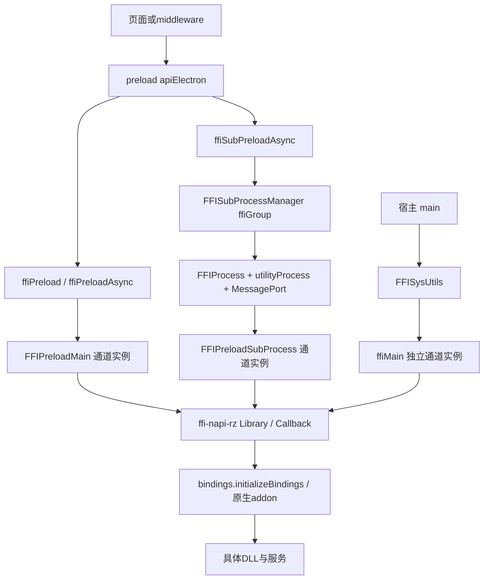

# 当前宿主 FFI：加载、参数、回调、错误与退出

本文静态复核 `.ref/host-4.0.827/` 的通用原生调用链，补充 [宿主完整地图](host-architecture-current.md) 和 [DLL 契约](dll-function-inventory.md)。官方包来源仍固定于2026-10-02；本轮没有查询实时新版本，没有执行宿主、下载的 JS 或 DLL。

机器原文：[host-ffi-current-evidence.json](host-ffi-current-evidence.json)。维护工具：[audit-host-ffi-current.cjs](../../tools/audit-host-ffi-current.cjs)。证据覆盖26份 JS 与1份依赖 package.json，保留477条原文锚点、92个 switch 分支、6个桥/IPC调用和27组核对合同。每条 `anchors` 都有当前文件路径、SHA-256、UTF-16 `[offset,end)` 与原文；本文用 `alias + name` 对应这些记录。38组/78项 Windows SysUtils ABI声明另按源顺序保存，不能当作78个函数正文已恢复。

## 三套实际调用实例

| 调用侧 | 当前源链 | 结果边界 |
| --- | --- | --- |
| `doDLLMainAction(channel,arg)` | preload `ffiPreload` → main `Ge.callDLL` | JS函数为async，但默认分支执行同步原生调用 |
| `doDLLMainActionAsync(channel,arg)` | `ffiPreloadAsync` → `Ge.callDLLAsync` | 默认分支调用FFI函数的`.async` |
| `doDLLSubProcessActionAsync(channel,arg)` | `ffiSubPreloadAsync` → `Je.callDLLAsync` → group进程 → child wrapper | 通信任务结果，不等于业务操作成功 |
| `doDLLAction` / `doDLLActionAsync` | preload只输出deprecated日志 | 这里没有转发到DLL |
| 宿主 `FFISysUtils` | main `Ve=require("./modules/ffi/ffiMain")` → `new no(Ve)` → `this.ffi.callDLLMain/Async` | 实际在用的另一套封装 |

证据：`preload`五个API属性、`main`三个`ipc:*`与`legacy-ffi-sysutil-constructor`；`SysPlatform`按platform导出win/mac；`SysWin.constructor/initDll/callDLLAsync`证明注入和消费。`Ve`有声明与构造参数两处引用，不能因没有直接写`Ve.callDLLMain`而判定不可达。

## 通道、加载与锁

`Main/Sub._handleAction_ConfigureFFI`先查`ffiLibMap.get(channel)`。已有实例只补调用者URL并返回`{result:true,reason:"dll already loaded"}`；不核对新请求的dllPath、apiObj或产品身份。新通道才检查文件存在并调用`ffi.Library`。Main另外登记DLLRegistry；Sub进程登记由manager完成。

通道、DLL路径、PID、deviceContainerId、ffiGroup是不同输入。两个请求同通道会复用已有实例；具体产品是否冲突还须由它的实际通道表达式证明，不能按DLL文件名猜测。`Registry.registerMainDLL/registerSubprocessDLL`仅保留首次通道/PID记录，是诊断元数据，不保证列出全部实际加载库。

Main/Sub的`callDLL/callDLLAsync`均按通道建立async-mutex，await acquire并在finally释放；不同通道即使同路径也不是同一把锁。生命周期`_callDLLNoAsync`直接进入同步调用，绕过锁，不能把所有原生调用描述为统一串行队列。

## 参数、指针与错误

`Main/Sub._handleAction_Default`与`_callDLLFunctionAsync`按下表分派，FFI代理随后检查参数数量和类型。

| `payload.actionArgs` | 同步调用 | 异步调用 |
| --- | --- | --- |
| undefined或缺失 | `lib[action]()` | `.async(callback)` |
| 数组 | `lib[action](...args)` | `.async(...args,callback)` |
| 其他值，包括null | `lib[action](value)` | `.async(value,callback)` |

缺库、未知动作或同步异常多为日志后undefined；ConfigureFFI使用result/reason结构。不能将这些返回统一解释成成功或空数据。

返回对象若有readCString，宿主复制为字符串，然后在finally调用同库FreeMalloc；没有FreeMalloc只警告。这是宿主按返回对象进行的处理，不能反推所有pointer返回都是该DLL拥有的CString。readCString抛错时释放标志尚未置true，finally存在也不能证明所有指针都释放。结构体、借用指针、句柄与缓冲所有权仍需逐native函数审查。

Main/Sub异步回调用`(err,value)=>resolve(value)`，没有检查err；底层ForeignProxy在原生错误时可`callback(err)`，这里会转成undefined。`Process.handleResponse`记录error但仍resolve(result)，`Process.callDLLAsync`捕获通信错误后也可返回undefined。manager批处理的“executed successfully”只证明await返回，不能证明DLL成功。原代码的异常语义保留为事实，不能替它改成预想中的拒绝或成功。

## 回调与消费者

`Main/Sub._handleAction_SetNodeFFIEvent`用`void(string)`声明回调并保存在ffiCallbackMap。已有通道回调直接复用并返回true，不是每次重新订阅或回放初始状态。

回调JSON.parse后只处理event/events；Main仅向urlList包含的、未destroyed/crashed/disposed的webContents发送。event发送完整对象，events发送对应字段。Sub先发送ffi-event到父进程，再由manager按URL过滤。这里没有自动将PID/container/taskId作为每条事件的业务路由。

当前`Entry.exports.CanUseAnneCallback`JS直接返回true；Main/Sub同时检查该API和请求useNewCallback。`Callback.Callback`支持Anne布尔重载：常规模式从参数指针解引用，Anne模式消费原生值，回调对象保留CIF引用。DLL内部线程、参数有效期及注销仍没有由JS代码证明。

## 子进程任务链

manager除APIToCallWhenExit广播外要求truthy ffiGroup，map按group隔离；ConfigureFFI且有dllPath才创建FFIProcess对象。对象存在、OS进程存在、消息通道就绪、DLL加载和设备观察是不同阶段。

1. `Process.callDLLAsync`生成taskId并将taskId/URL写入arg，ConfigureFFI先startSubProcess。
2. startSubProcess先登记URL；已有进程提前返回，位于addDLLPath之前，所以后续库可能未进入诊断路径列表。无进程才检查DLL、登记路径并fork。
3. 打包分支fork `app.asar.unpacked/electron/modules/ffi_subprocess/_ffiProcessRoute.js`，它再指向packed ASAR中的`_ffiprocess.js`。
4. spawn后建立MessageChannelMain并传递端口；_ensureReady等待ready或crash，这段没有setTimeout。
5. child端口接通就发送subprocess-ready，此时没有执行具体ConfigureFFI/Initialize，不能当作DLL或设备就绪。
6. handleAction先postMessage再getResult登记pending；保留顺序事实，不未经运行断言发生竞争。
7. getResult为动作结果设置10000ms timer；响应清除timer/任务。超时删除任务并拒绝等待，没有取消native调用的代码；迟到响应只记录未处理日志。

child要求taskId；调用wrapper后发ffi-response，抛错时发error。wrapper本身会吞多种错误，不能仅因child有catch断言DLL错误全部上报。

terminate拒绝pending、关闭端口、移除进程监听、重置process/URLs/readiness，但未清空DLL路径列表/PID。正常退出直接terminate，异常退出发crash后terminate，manager只在crash处理删除group和登记。_ensureReady对正常退出的等待完成路径尚未闭合，不能补成必定解除等待。

## 生命周期与 FreeFFI

| 动作 | Main/Sub同步dispatch | Main异步dispatch | Sub异步dispatch |
| --- | --- | --- | --- |
| ConfigureFFI_APIToCallWhenExit | 登记 | 登记 | 登记 |
| Set/Remove ExitDevice、Shutdown、Suspend | 有专门分支 | 默认DLL查询 | 默认DLL查询 |
| SkipFFILoggingChannelEvent | 有专门分支 | 默认DLL查询 | 默认DLL查询 |
| APIToCallWhenExit / APIToCallWhenSuspend | 默认DLL查询 | 默认DLL查询 | 执行本进程生命周期集合 |
| FreeFFI | 返回true | 返回true | 返回true |

原文见action_cases的owner与完整dispatch。默认DLL查询不等于必定失败：库若声明同名动作仍可能调用。产品登记动作须核对实际API选择。

`generateKey_APIToCallWithPID`连接`channel-productId-deviceContainerId`，缺值回落0；设备退出/shutdown/suspend执行用`split("-")[0]`取通道，原通道自身含连字符就被截断。每行actionArgs第一项动作名，其余为参数；行间用delay??2及sleepWithWhileLoop。`Common.sleepWithWhileLoop`实际以performance.now加传入值忙等，故默认间隔是2毫秒；native任务是否在此间隔完成仍未证明。

Main退出调用`callDLL(undefined,channel,{action})`中`event?.sender.getURL()`会对undefined event短路，不能误报必然异常。Sub异步使用arg.url||"unknown"；生命周期没有renderer URL不等于获得设备身份。

Main/Sub的_handleAction_FreeFFI为空，dispatch直接返回true，没有移除lib/callback/mutex或显式close。依赖提供`FreeLibrary(lib)`→dllObj.close，成功后清dllObj，但宿主FreeFFI没有调用它。Legacy FreeFFI仅删除lib map记录，不显式FreeLibrary；map删除也不能证明DLL卸载。

退出编排见 [宿主退出链](host-architecture-current.md)：子进程exit → Main设备/shutdown/exit → SysUtils Terminate → mapping/simple shutdown。本轮未执行这些有副作用的原调用。

## SysUtils实际分支与依赖ABI

`SysWin.initDll`按传入路径加载，38组78项声明按顺序合并，依次尝试全部组、少最后一组、少最后两组；第三次失败即停止。是三次声明前缀尝试，不是三个不同DLL路径。Library预先绑定所有声明，一个导出缺失可能使整次配置失败，不能无条件宣称78项均已加载。

成功后读取GetDLLVersion并注册handleFFIEvent/useNewCallback；Initialize在声明中，不表示这个方法已执行它。Legacy ConfigureFFI已有通道时返回false，区别于Main/Sub结构化true复用；Legacy没有上述mutex。

SysWin事件将networkStatus、systempoweroff、suspend/resume交给宿主编排；foreground/keyboard事件按URL列表发，其他广播给有效webContents。StopMonitorKeyboardLayout却从foregroundEventList过滤赋给键盘列表，并按foreground数量决定是否提前返回，这是原代码交叉列表行为，不以合理化逻辑替代。Mac源已保留，不能套用Windows回退；Mac未isInit时getNetworkStatus返回true也不是真实网络读取。

依赖package指定ffi-napi-rz 1.0.11及入口./lib/ffi。Library为每项apiObj立即取symbol，第三项options决定abi/async/varargs。async:true直接存ff.async，与宿主再取.async属性的假设需按具体声明核对。

ForeignFunction用ref.coerceType后创建CIF和代理；未指定ABI使用bindings.FFI_DEFAULT_ABI，不能写死数值或统一套stdcall。ForeignProxy同步要求恰好numArgs、异步要求numArgs+callback，ref.alloc和指针数组进入ffi_call/ffi_call_async。Variadic先消费类型生成缓存函数，CIFVar进入ffi_prep_cif_var，不是普通函数自动接受任意数量业务值。

Type将间接类型/数组映射pointer、递归构造struct；Entry按ref.sizeof.long选择32/64位类型。Bindings通过node-gyp-build取得addon并initializeBindings(ref.instance)，这是实际native边界，本轮未加载。DLL函数正文、具体allocation、回调native实现、各产品初始化参数/返回消费者仍有独立未知；全文不声称全部原代码已恢复。

静态复核：`node tools/audit-host-ffi-current.cjs --check`。
