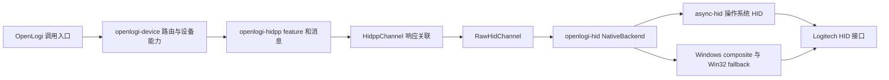

# OpenLogi 设备通讯静态审阅与 Razer 证据边界

2026-10-09。审阅对象是外部开源项目 [AprilNEA/OpenLogi](https://github.com/AprilNEA/OpenLogi)，固定到 `master` 的 commit `1505c6525470bc0a38ae3ba79d70e950347d2532`。结论：可以参考其通讯层的拆分、接口选择、响应关联与错误处理；本轮没有建立任何 Logitech HID++ 命令与 Razer 设备协议之间的等价关系，不能据此移除 Razer DLL 或改写 Razer 命令。

本轮只下载、读取和校验文本。未运行 OpenLogi、其 Rust/下载代码、安装器、DLL、本项目应用或硬件访问。未修改本项目 Rust、依赖或运行时资产。Razer DLL 写回仍遵循 [AGENTS.md](../../AGENTS.md) 的后置范围；读取函数存在、静态协议实现存在和设备读取成功分别记录。

## 版本、范围与可复核证据

[机器证据](openlogi-device-communication-review.json) 保存 157 个 commit 固定文件的原始字节数、SHA-256、Git blob SHA-1 和 raw URL；每份文件均与该 commit 的 GitHub tree size/blob 核对。范围为根 README/Cargo.toml/Cargo.lock/LICENSE，以及 `openlogi-hid`、`openlogi-hidpp`、`openlogi-device`、`openlogi-device-registry` 的通讯源码子集。测试目录、replay 目录和 scripted backend 被排除；文件中 `cfg(test)` 区域可能随原件保留，但未运行。

25 份重点收据包含原文、文件 SHA、行号和 UTF-16 半开区间。44 个直属 feature 模块另列静态 `creatable` 属性与 public async 方法名。这份 feature 清单只索引源码声明，不能证明 GUI 激活、硬件支持、完整线协议语义或设备成功响应。不是整个 OpenLogi GUI/agent/camera 的功能审计。

| 关键原件 | SHA-256 |
| --- | --- |
| `Cargo.toml` | `faef63d56b791362ad275e46a7ee85e8ef0e10b424a5b37ab1b0b18e266f5746` |
| `Cargo.lock` | `2cf9e093d57a153e2a0b0c0188c6939b8a41a9c8d923677e9c3bd598823c0752` |
| `crates/openlogi-hid/src/transport.rs` | `9a9cc7454b720e74f31d891f196bc5a74be0f5e435ab5c4dd67b3d03def14641` |
| `crates/openlogi-hid/src/transport/windows_hid.rs` | `cd48af1e142c8f3d800eecd152d14760f705e36c4cb07c1504c9f8f9da12d599` |
| `crates/openlogi-hidpp/src/channel/message.rs` | `ef6aa535500ed0fbf80dcd070b8c9d05c4982705c0cab8f1261f9ec1fd3103c9` |
| `crates/openlogi-hidpp/src/feature/adjustable_dpi.rs` | `7663bd353b84851d83884e6512c5e9b3b26bdf1fd0f82c806c94b559fc93cf4f` |

源码 README 宣称面向 Logitech 鼠标、键盘、摄像头，支持 macOS/Linux/Windows；仓库版本为 `0.8.11`，manifest license 为 `MIT OR Apache-2.0`。README 的 Windows 11 实机验证属于上游声明，本轮没有复验，也不能把“跨平台”理解为所有型号及所有功能都支持。摄像头 UVC 链路不在这次 HID++ 子集内。

## 通讯栈实际分层



`openlogi-hid/src/lib.rs:1–42` 明确把 HID++ 设备逻辑留在 `openlogi-device`，自身提供本机 backend、枚举/open、Windows composite channel、macOS 权限和磁盘 probe cache。`NativeBackend` 实现 `HidBackend`，缓存本轮枚举产生的 OS handle；缓存 key 同时包含 node id 与 usage pair，防止 macOS 同一 registry id 的不同 collection 覆盖真正选中的接口。见收据 `hid-backend-role`、`native-backend-open`。

`Cargo.toml:45–56` 把 `async-hid` 指向 crates.io 的 `openlogi-async-hid =0.5.3-openlogi.1`；`Cargo.lock:5605–5625` 锁定 checksum `883f2f413df036fd1b943bcd99d83cb0cfd76d0dc2586a16773f6d9aee1f5887`，其依赖含 `windows 0.61.3`、`nix 0.29.0`、`objc2-io-kit` 等。这里只核对 lockfile，没有下载该 dependency 的实现，不能声称其内部平台代码已经审计。

Windows 额外直接依赖 `windows-sys 0.61`，启用 `HumanInterfaceDevice`、`Foundation`、`Security`、`FileSystem`、`System_IO`。`windows_hid.rs` 实际调用 `CreateFileW`、`WriteFile`、`HidD_SetOutputReport`、`HidD_SetFeature`、`HidD_GetPreparsedData` 和 `HidP_GetCaps`；这不是仅存在于 lockfile 的无关依赖。见 `windows-dependencies`、`windows-write-fallback`。

因此，“用 Rust 写协议”本身不能推出“不需要 Windows API”。更换本项目依赖仍需单独核对 Razer 原代码、目标平台访问方式及现有接口契约，本审阅不改变该决策。

## 发现、接口与接收器子设备

`transport.rs:275–330` 先从 OS HID backend 枚举，再按 Logitech VID 和供应商 collection 选择 HID++ 节点，并排除 Litra 节点。VID 来源为 `openlogi-device-registry` 的 Logitech 常量。`transport.rs:174–231` 使用三个 long-report usage pair：

| usage page / usage | 原码用途 |
| --- | --- |
| `0xff00 / 0x0002` | USB、Bolt/Unifying 接收器、Bluetooth classic |
| `0xff43 / 0x0202` | Bluetooth LE 直接连接；非 Windows 路径标记 long-only |
| `0xff43 / 0x0602` | 部分有线 G 系列键盘，同时支持 short/long |

Windows channel 为 short/long 分别打开 collection，按 report id 分派写入，并复用 reader 读取两个端点。正常 `async-hid` output write 出错才尝试 native fallback；typed `Disconnected` 被保留，避免以重开失败覆盖断连事实。fallback 可尝试不同 desired access、caps 长度填充、`WriteFile`、output report 和 feature report；这是上游的兼容策略，不是 Razer 可任意尝试的命令方案。见 `windows-composite-open`、`windows-composite-read`、`windows-write-fallback`。

接收器表登记 10 个 Logitech PID：`c52b/c532/c534/c537/c539/c53f/c541/c547/c548/c54d`。产品品牌与协议分开：Nano/Lightspeed 条目目前分派到 Unifying 协议；`c548` 分派到 Bolt。表中“硬件验证/Solaar 对照”的描述仍是上游原码说明，不是这次实际验证。见 `receiver-identities`。

| 子链路 | 已读原文行为 | 不能推导的事情 |
| --- | --- | --- |
| Bolt | 读取 unique id、pairing count、arrival；在 receiver register phase 下顺序读取 occupied slot 身份，释放 phase 后并行 walk 各 device index 的 feature table；计数不足不发布为完整健康快照 | 不证明 Razer V2 无线状态表也是槽位协议 |
| Unifying | pairing count 是健康门槛；trigger/drain device-arrival 给出 paired slot 的 fresh list；按 slot 去重排序，受同寄存器响应无法区分的约束保持 register phase | 不证明接收器 USB PID 就是鼠标 PID，也不能凭空补出未上报子设备 |
| Direct | 使用自身 `0xff` 地址；完成 feature walk 后，以 battery/buttons/pointer/lighting 判别真实外设与 receiver secondary interface；walk 失败保留 transient failure | 不证明“无法查询”就是无鼠标，更不能用空能力冒充设备类型已确认 |

原文收据分别为 `bolt-slot-discovery`、`unifying-arrival-discovery`、`direct-device-probe`。OpenLogi 自己也区分 OS 节点、接收器和逻辑外设；其发现逻辑并不是通过一个通用 DLL 自动返回全部产品。

## HID++ 报文与命令

`channel/message.rs` 规定 short `report_id=0x10`、总长 7 字节；long `report_id=0x11`、总长 20 字节，按精确长度解帧。`protocol/v20.rs` 的 header 是 `device_index, feature_index, function_id(4 bit), software_id(4 bit)`。feature index 来自设备 feature table，不能把 feature ID 直接写成 index。`RootFeature.get_feature` 用 `0x0000` feature 的 function 0、big-endian feature ID 查询 index/type/version；index 0 回应表示目标 feature 不支持。见 `report-framing`、`hidpp-v20-header`、`feature-discovery`。

`HidppChannel` 根据 addressing header 匹配响应，同 header 的 pending request 不能同时上链；默认响应预算 5 秒，超时/取消后 header 保留 1 秒，处理迟到响应；只有调用方确认不可变查询才可用 `AdoptIdentical`。这些值仅属于该 commit 的 OpenLogi，不能当作 Razer 超时值。见 `response-lease-timeout`。

以下命令正文已读取并保存，均为 Logitech 协议事实：

| feature | 读取 | 更改/事件 | 源码收据 |
| --- | --- | --- | --- |
| `0x2201 AdjustableDpi` | function 0 sensor count；1 DPI list；2 current DPI。DPI 为 big-endian；列表支持显式值与 range marker | function 3 写 sensor index + DPI 高低字节 | `dpi-command` |
| `0x2202 ExtendedAdjustableDpi` 选择 | device 层先查 `0x2201`，缺失再查 `0x2202`；当前 UI 驱动 sensor 0 和 X 值 | 扩展写有 X/Y/lift-off 组合参数，不能简单套 `0x2201` 单值包；本收据覆盖选择与该说明，未声称完整审计全部 extended command | `dpi-feature-selection` |
| `0x2110 SmartShift` | function 0 读取 wheel mode、auto disengage、default | function 1 设置；None 以 0 sentinel 保持现值，非零值有协议含义 | `smartshift-command` |
| `0x1b04 ReprogControlsV4` | function 0 count；1 CID info(long)；2 CID reporting；4 capabilities（v6） | function 3 reporting/remap(long)，5 reset（需能力）；diverted buttons/raw XY 等通过 event 解码 | `reprog-controls-command`；event 文件在 inventory 内，未将其所有事件计为本轮逐字段闭合 |
| `0x1004 UnifiedBattery` | function 0 capabilities；1 battery info，包括 percentage/level/status | event sub-id 0 解码相同字段；原码对 payload[3] 外部电源含义明确保留未知 | `battery-command-event` |

鼠标按键 remapping、capture、OS 输入注入和快捷动作之间仍有 agent/session/平台链路；`set_cid_reporting` 存在不表示所有应用动作都已写入设备。部分“查询”也需发送 report、开启通知或 trigger，分类要按实际副作用，不能因为 UI 叫刷新就把整个流程当成纯被动读取。

## 与当前 Razer 原代码逐层对照

Razer 当前 host 原件 `.ref/host-4.0.827/electron/modules/ffi/FFIPreloadMain.js` SHA 为 `64b1dbe3dead30176b3da92a427938eb24c264df8d5e7fff7930eedb75bb345a`。机器证据保留 `_handleAction_ConfigureFFI` 的真实半开区间和原文：它接收 caller 的 `dllPath/apiObj`，检查路径存在，以 `ffi-napi-rz.Library` 建立库，按 channel 保存，并登记 DLL。复用 map、callback、参数/返回和 subprocess 行为见 [当前 host FFI 审计](host-ffi-current.md)。这套 ABI/生命周期不能被 OpenLogi 的 `RawHidChannel` 直接等同。

实际产品 native caller 和路径来源见 [当前工厂链](native-factory-current.md)、[3886 Hue 补充](native-3886-legacy-hue-current.md)。例如产品 70 的当前 caller/selector 原件已在机器证据重新核 SHA：选择器读取 `installedResources`，按资源 name、usedBy、filePath 生成路径，caller 传入 init。这是库选择/初始化证据，不是设备线上报文。

Razer 的原生库及函数分母见 [DLL 功能清单](dll-function-inventory.md)。原版 USB/HID 枚举与 receiver query 应继续分别追 [USB 原码证据](usb-native-current-evidence.json)、[接收器 HID 原码证据](receiver-native-hid-current-evidence.json)，不以 OpenLogi 的 Logitech discovery 来填充 Razer 未知调用。

| 可参考的组织/验证方法 | 若迁移至 Razer，还必须取得的原码证据 |
| --- | --- |
| transport、protocol、inventory 分层 | Razer 原版实际调用链、DLL/原生件身份和每个方法的职责 |
| 根据 report 和 collection 选择端点 | 目标 Razer 产品的 HID descriptor/接口选择与 DLL 对应代码 |
| request/response correlation、typed disconnect | Razer 请求序号/命令/响应匹配、状态码、超时/重试/事件正文 |
| 接收器与逻辑 device identity 分开 | Razer peer/relay/无线状态返回、产品 PID 映射及生命周期 |
| capability gate 后调用 | 当前 Razer feature、产品分支、getter/setter 参数与返回语义 |

不能移植 Logitech VID/PID、`0x10/0x11` 报告、HID++ feature IDs、receiver slot 或命令载荷。DLL export 名字或 JS FFI 声明也不构成完整 DLL 逆向；替换 DLL 前必须继续静态追到 DLL 机器码中的接口选择、报文构造、调用 Windows/驱动/服务的层次、校验与响应解析，并证明目标产品适用性。仅凭本外部审阅没有任何一个 Razer 命令取得替换依据。

## 静态复核

工具 [audit-openlogi-reference.cjs](../../tools/audit-openlogi-reference.cjs) 只使用文件读取、hash、文本区间及 Git blob 校验，绝不 import/eval/require 下载源码。

```text
node tools/audit-openlogi-reference.cjs --check
```

缺少 `.work/openlogi-static-reference` cache 时，可用 `--fetch --check` 按证据中固定 commit URL 重新准备相同文本，逐文件核对 SHA/Git blob，再静态复核；不会自动跟进远端 master，不会运行仓库代码。此文档及其 JSON 是独立外部参考，不能提升当前 Razer UI/设备读写完成状态。
