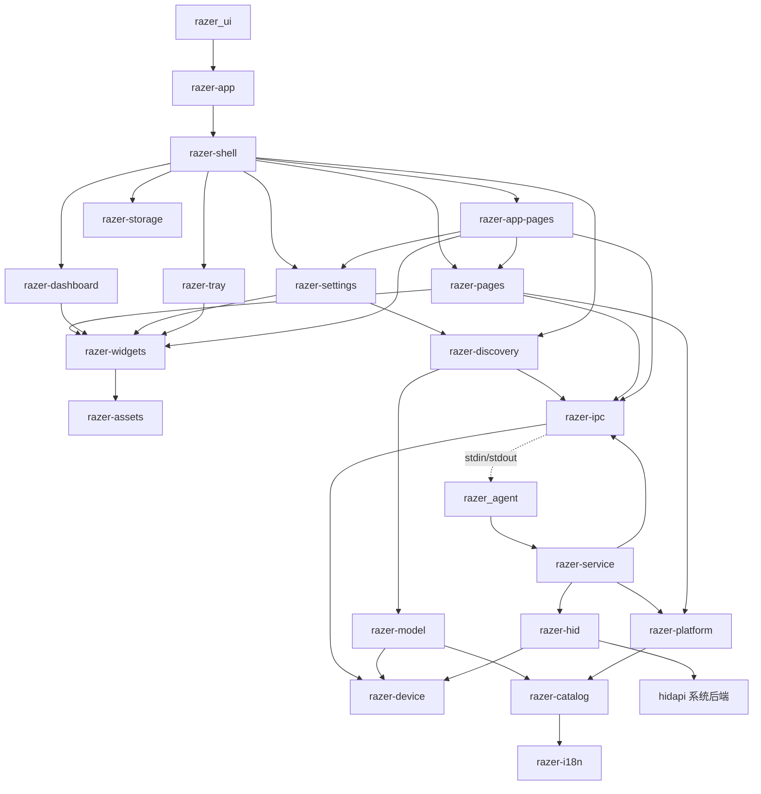

# 当前 Cargo workspace 架构

2026-10-09。按 OpenLogi 的职责边界整理为 20 个库 crate、GUI 可执行包及 headless agent 可执行包。源码实际位于各包 `src/`；根 [Cargo.toml](../../Cargo.toml) 的 GUI 入口为 [app/main.rs](../../app/main.rs)，关闭自动 binary 发现。内部依赖集中在 `workspace.dependencies`，各包用 `workspace = true` 引用。

## 包的归属

| 范围 | 包 | 职责 |
| --- | --- | --- |
| 入口 | `razer-app` | CLI、GPUI 初始化、主题、打开主窗口；一个 Rust 文件 |
| 后台入口 | `razer-agent` | `razer_agent` 二进制；调用 worker；无 GPUI 依赖 |
| 宿主协调 | `razer-shell` | 窗口、导航、标签页、事件订阅、工作区聚合；26 个 Rust 文件 |
| 应用页面 | `razer-app-pages` | Macro、Profiles、Alexa、Armory、配对、引导、迁移、反馈、更新说明、应用选择、模块、Gamer Room、Chroma、固件页面 |
| 产品页面 | `razer-pages` | 产品工作区、设备页面、编辑控制器、产品导航、键盘几何交互 |
| Dashboard | `razer-dashboard` | 卡片、布局、分组、拖动状态、教程；宿主提供动作闭包 |
| 设置 | `razer-settings` | 设置与连接观察页面、独立设置窗口内容；发出宿主动作事件 |
| 托盘 | `razer-tray` | 图标注册、菜单、左击弹层、账户、设备列表与平台适配；发出点击事件 |
| 共享展示 | `razer-widgets` | 颜色、滑块、提示、滚动、教程、链接、共享按钮 |
| 应用状态 | `razer-state` | 应用偏好和共享本地颜色状态 |
| 数据模型 | `razer-model` | 设备、领域、ProfileSettings、明确标记的 preview 数据；无 GPUI |
| 声明目录 | `razer-catalog` | 当前源生成的产品/页面注册、原生库声明、已核实的 getter 筛选与加载限制；不加载 DLL |
| 设备逻辑 | `razer-device` | Razer 报文、响应、能力、逻辑身份、查询重试、通用 HID 契约；无系统后端 |
| HID 实现 | `razer-hid` | 实现设备层契约；hidapi、collection、Feature 传输与 descriptor |
| 观察投影 | `razer-discovery` | IPC 观察到产品/接收器身份的映射；无 UI、DLL 加载或硬件后端 |
| 客户端/IPC | `razer-ipc` | 请求/响应、JSON 帧、客户端、超时、所属子进程退出清理；不依赖设备服务实现 |
| 后台执行 | `razer-service` | worker 分发、HID/USB 平台身份补充、现有 DLL/服务查询适配；无 GPUI |
| 平台适配 | `razer-platform` | 系统面板、只读系统属性、拓扑变化通知、已安装库文件定位；不加载 DLL |
| 本地保存 | `razer-storage` | 文件路径、冲突检查、备份、临时文件保存；不执行设备写回 |
| 语言 | `razer-i18n` | 官方语言资源与 locale 查询 |
| 资源 | `razer-assets` | 官方资源、字体、布局元数据与 AssetSource；不依赖模型或设备层 |

## 依赖与运行边界

箭头表示 Cargo 依赖；虚线表示进程通讯。图省略共同依赖，完整清单见 [架构记录](workspace-openlogi-architecture-current.json)。



GUI 页面、壳层、设置、Dashboard、托盘均不依赖 `razer-service` 或 `razer-hid`。协议定义 `HidNode`、`HidBackend`、`FeatureTransport`，系统后端反向依赖协议契约；模型、资源和共享控件不携带系统 HID 实现。目录的 getter 筛选仅选择原证据中的条目，实际函数调用留在 worker。

`razer_agent` 放在 GUI 同目录时，IPC 客户端启动该独立进程。旧的仅根包开发入口仍兼容 `razer_ui --service-worker`，在 GPUI 初始化前分发；根 `razer-app` 因该兼容入口及原有诊断 CLI 仍链接服务包。当前 wire 格式、请求编号、大小限制、超时、Windows Job 清理和错误处理保持原实现，没有改为 OpenLogi 的 tarpc/local socket，也没有新增常驻后台生命周期。

`razer-shell` 原有 132 个 Rust 文件，目前为 26 个、约 8400 行，其中 5 个为独立测试文件，其余文件也包含部分内联测试。留下的是主窗口、标签页、窗口策略、宿主动作路由和本地工作区聚合。`main_pages/dashboard_cards.rs` 为卡片提供导航/提示闭包；`tray.rs` 订阅托盘事件并路由；`settings_window.rs` 只负责打开/聚焦策略；`firmware_update.rs` 只负责宿主标签生命周期。产品与应用页面主体、托盘弹层、Dashboard 和设置内容已在所属页面包；标题栏、账户菜单、未保存提示以及 Chroma 独立窗口的宿主布局仍由 shell 渲染，不能描述为完全没有 UI 的入口包。

应用页面通过实体方法或事件与宿主交互，不反向依赖 `AppShell`。Macro/Profiles 依赖产品页面提供的本地工作区绑定接口，MacroLibrary 仍是产品页面包中的共享 GPUI 本地状态。纯文档/控制器的进一步拆分尚未完成，不能把它描述为无 UI 的数据核心。

跨包调用直接引用所属包，已删除重复 `ui`/`backend` 门面和依赖包别名转发。合成键盘的图片映射由 UI 显式调用 `razer-model::demo::artwork_product_id`，不进入发现、协议能力或传输身份。本地保存格式、UI 草稿和已有编辑行为保留；这次架构整理不扩大设备写回范围。

## OpenLogi 源码对照

固定 commit `1505c6525470bc0a38ae3ba79d70e950347d2532`，源码 SHA-256 与 URL 见 [架构源码记录](workspace-openlogi-architecture-current.json)，通讯审阅见 [OpenLogi 记录](openlogi-device-communication-review.md)。仅静态读取，不执行外部项目。OpenLogi 提供架构参考；Razer 命令、能力和页面行为仍由当前官方源及原审计支持。

| OpenLogi 边界 | 本项目落实 |
| --- | --- |
| `openlogi-device/backend.rs` 定义契约，`openlogi-hid` 实现它 | [backend.rs](../../crates/razer-device/src/backend.rs) 与 [native.rs](../../crates/razer-hid/src/native.rs)；`razer-hid → razer-device` |
| desktop 组装，UI 共享展示 | 启动、宿主、应用/产品页面、Dashboard、设置、托盘和共享控件分开 |
| core、registry、assets 分开 | 模型、源声明目录、嵌入资源分别归属；都不依赖硬件实现 |
| agent/core 与 IPC 分开 | [agent 入口](../../crates/razer-agent/src/main.rs)、[worker 分发](../../crates/razer-service/src/runtime.rs)、[IPC 客户端](../../crates/razer-ipc/src/lib.rs)；IPC 不依赖服务 |

未照搬 Logitech HID++ 命令、async-hid、写回状态机、常驻 agent、IPC 协议、macOS 托盘进程归属等细节。这些不是 Razer 功能依据。三平台运行、窗口视觉及硬件结果仍未验收。

## 参考与验证

原 [src/README.md](../../src/README.md) 目录保留 commit `dc7911e2327bc5efda679537552c86eace701296` 的 444 个文件，见 [字节记录](reference-src-current.json)。它是旧 Rust 比较副本，不是厂商证据，不参与编译，不应继续修改。厂商依据仍是 AGENTS.md 指定的现行 `.ref` 源码。

[迁移映射](workspace-relocation-current.json) 记录归属、拆分及最终指纹。维护工具和 Markdown 路径随实际迁移更新；历史实现指纹不表示新包重新完成了原功能审计。资源、源生成能力、语言、字体和 fixture 保留。通讯行为单独见 [跨平台 HID 契约](cross-platform-hid-current.md)。

```text
cargo fmt --all -- --check
cargo check --locked --all-targets --workspace
cargo check --locked --all-targets -p razer-ipc
cargo check --locked --all-targets -p razer-platform
cargo check --locked --all-targets -p razer-service
cargo check --locked --all-targets -p razer-agent
python tools/validate-workspace.py
python tools/validate-current-docs.py
python tools/audit-portable-hid-current.py --check
```

本机仅有 Windows Rust target。单独检查 IPC、托盘曾发现全 workspace feature 合并掩盖的 Windows feature 缺项，已在所属包显式补齐。检查包含已有测试代码类型检查，没有执行测试、应用、agent、DLL 或硬件命令。Linux/macOS 源码核对不等于运行验收。资源总校验仍存在重构前 `audio-demo-play.svg` 的 manifest SHA 不匹配；未修改该资源或盲目刷新其 hash。
